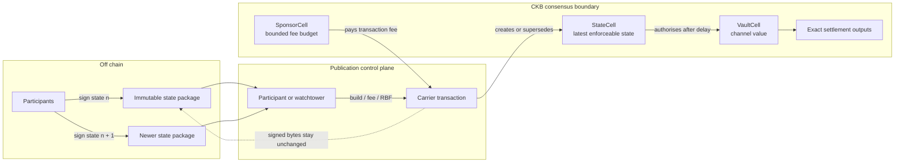
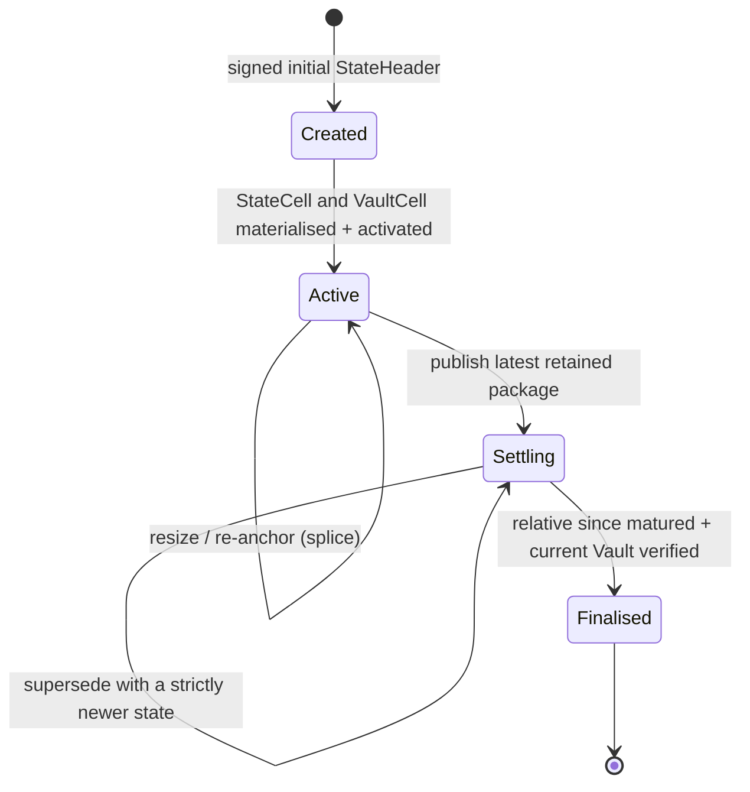
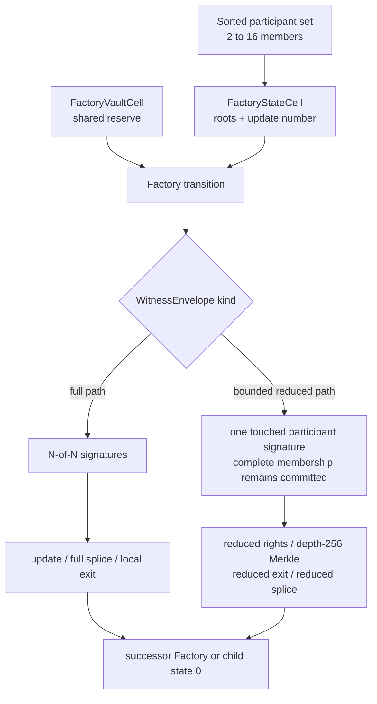
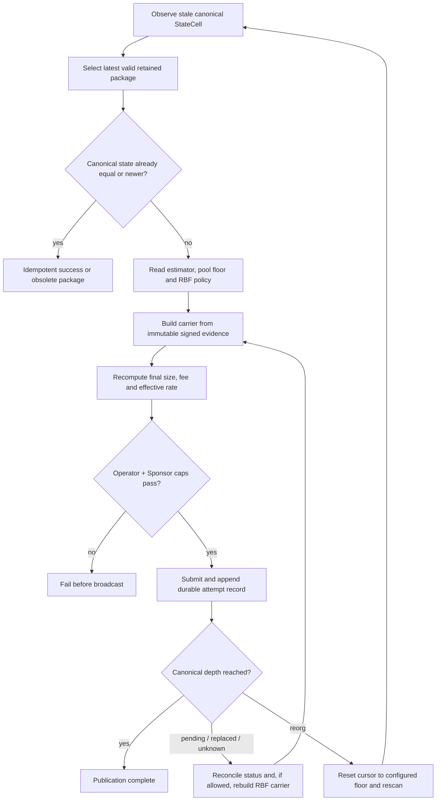
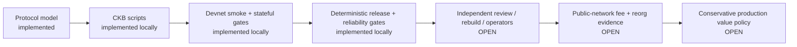

# Morph Channel

Morph Channel is a CKB-native off-chain channel and channel-factory research
implementation. Participants exchange signed state off chain; CKB scripts keep
the enforceable state, protected value, and publication fee budget in separate
cells.

**Current source release:**
[`v1.11.0 — Publication Verification Follow-up`](https://github.com/a19q3/Morph/releases/tag/v1.11.0)

> **Safety boundary:** Morph is controlled-devnet research software. It is not
> mainnet-ready, is not approved for real assets, and has not completed the
> independent review and public-network evidence gates described in
> [Mainnet Readiness](docs/mainnet-readiness.md).

If you are new to the repository, read [The protocol in one picture](#the-protocol-in-one-picture),
then choose a path under [Quick start](#quick-start). Protocol reviewers can go
straight to [Security invariants](#security-invariants); operators should also
read [Publication and watchtower reliability](#publication-and-watchtower-reliability).

## At a glance

Morph separates three channel authorities that are often coupled, and extends
the same pattern to a Factory reserve boundary:

| Boundary | On-chain object | Authority | What it cannot do |
| --- | --- | --- | --- |
| State | `StateCell` | Participant-signed `StateHeader` and monotonic state number | Spend the channel vault merely by existing |
| Value | `VaultCell` | Vault script plus the authentic, current settling state | Turn channel value into publication fees |
| Fee | `SponsorCell` | Sponsor lock and operator publication policy | Rewrite participant evidence or settlement |
| Factory reserve | `FactoryStateCell` + `FactoryVaultCell` | Full-participant or explicitly bounded reduced proof | Treat the transaction fee payer as Factory authority |

That split gives Morph a narrow security objective: a fee-paying operator may
rebuild and replace the transaction carrying signed evidence, but it must not
change the evidence or gain authority over participant value.

## The protocol in one picture



The main objects are:

- **`StateHeader`** — fixed-layout signed channel state: logical channel,
  funding context, state number, phase, challenge policy, vault commitments,
  participants, and settlement descriptor commitment.
- **State package** — the header, participant signatures, and construction
  context retained off chain. A package can be published by a participant or a
  watchtower without giving the watcher participant private keys.
- **`StateCell`** — the single live on-chain carrier for the currently
  enforceable state track. A strictly newer valid state can supersede an older
  settling state before finalisation.
- **`VaultCell`** — holds CKB or registered xUDT value. It is consumed only at
  explicit value boundaries such as finalisation, resize/re-anchor, or Factory
  materialisation.
- **`SponsorCell`** — a separately funded, per-cell publication budget. Its
  lock enforces fee attribution, per-transaction and total limits, admitted
  state numbers, and clean sponsor change.

The stable integration identity is `channel_id`. A resize or re-anchor keeps
that logical identity but changes the exact materialised funding context:

```text
channel_id          stable logical channel
funding_epoch       signed generation label
funding_context_id  hash of the exact anchor and Vault commitments
```

Source code and wire-format names retain the historical term **splice** for the
user-facing resize/re-anchor operation.

## Channel lifecycle



1. **Open.** Both participants sign state `0`. The funding transaction creates
   the State and Vault objects, and activation binds the state to the Vault's
   exact CKB `OutPoint`; a byte-identical clone cannot substitute for it.
2. **Update off chain.** Participants exchange higher signed state numbers.
   Ordinary updates do not spend the Vault.
3. **Publish on dispute or failure.** A retained package becomes a carrier
   transaction. Sponsor capacity may pay the fee, while the signed header and
   witness stay byte-for-byte unchanged across fee attempts.
4. **Supersede.** Before finalisation, a valid higher state number beats the
   older settling state.
5. **Finalise.** After the canonical relative-block delay, the Vault script
   accepts only the authentic current settling StateCell and the exact
   committed settlement outputs.
6. **Resize/re-anchor.** Splice-in or splice-out changes the funding generation
   and exact Vault commitment while preserving `channel_id`. Splice-out signs
   the participant withdrawal lock and enforces the corresponding CKB/xUDT
   output on chain.

The current on-chain State phase surface is intentionally narrow: `Active` and
`Settling`. Host-side `Funding` and `Closed` values are lifecycle labels, not
additional accepted State-type phase bytes. Cooperative close is not part of
the current contract or CLI profile.

## Security invariants

The implementation and negative tests are organised around these properties:

| Invariant | Enforced by |
| --- | --- |
| Newer state wins | State-number monotonicity plus participant signatures in `morph-state-type` |
| Signed evidence is immutable during fee bumping | Package digest/witness comparison and carrier-only rebuilding |
| Vault provenance is exact | Content commitment plus canonical direct-CellDep `OutPoint` activation |
| Participant value does not pay publication fees | Separate Vault and Sponsor locks with exact fee attribution |
| Sponsor authority is bounded | Per-transaction cap, cumulative budget, admitted state-number range, and clean change |
| Settlement cannot use a fake StateCell | State type and State lock identity checks in `morph-vault-lock` |
| Factory fee payer is not Factory authority | Type-bound Factory State lock plus participant/reduced-proof authorisation |
| Reorg recovery does not trust an orphaned cursor | Persisted canonical block hash; mismatch clears context and rescans from `from_block` |
| Unknown wire shapes fail closed | Fixed lengths, versions, envelope kind/body length, and body commitment checks |

For every registered asset `a`, a value-changing Vault path must conserve the
committed value:

$$
V_{in}(a) = \sum Settlement_{out}(a) + \sum SuccessorVault_{out}(a)
$$

The second term is zero on finalisation and non-zero only when the transition
creates a successor Vault. Publication transactions do not appear in this
equation: their fee is attributed to Sponsor capacity.

The published state order is equally simple:

$$
n_{new} > n_{chain}
$$

Equal state is handled idempotently; an older package is obsolete. See
[Implementation Notes](docs/implementation.md) and
[Security Fixes](SECURITY-FIXES.md) for the exact script rules and named
negative tests.

## Channel factories

A Factory pools reserve rights while keeping child-channel materialisation
explicit. The Factory State commits membership, rights/access roots, update
number, challenge policy, and the exact Factory Vault. The Factory Vault owns
the reserve value.



| Path | Authorisation | Scope |
| --- | --- | --- |
| Factory creation, conservative update, local exit, full splice | All participants (`N-of-N`) | Full signed transition |
| Reduced-rights update | Exactly the touched participant | Fixed bounded rights body |
| Sparse-Merkle update | Exactly the touched participant | One right, fixed depth 256 |
| Reduced exit / reduced splice | Exactly the touched participant | Implemented fixed-layout proof only |

All paths commit the complete sorted participant set. Supported membership is
2–16; threshold subsets on full paths, duplicate or unsorted members, unknown
proof shapes, and counts outside the supported bounds fail closed. A Factory
exit materialises a child channel at state `0`; later child states use the
child's own bilateral signatures.

## Publication and watchtower reliability

The v1.10 hardening moved fee selection, CKB RBF, canonical confirmation,
challenge-window budgeting, and reorg recovery into the host/watchtower control
plane. v1.11 adds a final fee-convergence check after the initial carrier is
rebuilt. Neither release changes participant-signed evidence, CKB contract
source, or the contract wire format.



### Fee selection and convergence

For fee rate `r` and final serialized transaction size `s` bytes, Morph uses:

$$
fee(r,s) = \left\lceil \frac{r \times s}{1000} \right\rceil
$$

The controller observes the node estimator, confirmed statistics, pool fee
floor, and RBF floor, then applies the operator profile. Before broadcast,
v1.11 requires the rebuilt carrier's exact fee to equal the formula for its
**final** size and requires its effective rate to remain at least the selected
rate. The result must also fit the operator maximum, the Sponsor per-transaction
cap, the Sponsor's remaining cumulative budget, and occupied-capacity-safe
change.

CKB replacement uses a conflicting carrier that shares the contested StateCell
input; it may use a different SponsorCell. It is CKB transaction-pool RBF, not
a family of participant-pre-signed fee-bump transactions. The replacement must
meet the node-reported minimum replacement fee, while the StateHeader and
participant witness remain unchanged.

### Challenge-window budget

For measured end-to-end publication time `T`, conservative block time `B`,
reorg reserve `R`, canonical confirmations `C`, failover reserve `F`, and safety
margin `S`, the production sizing rule is:

$$
W_{min} = \left\lceil \frac{P_{99.9}(T)}{B} \right\rceil + R + C + F + S
$$

At runtime, confirmations already accumulated by the stale StateCell are
deducted. Publication is allowed only while actual execution time still remains:

$$
W_{configured} - confirmations_{spent} - (R + F + S) > C
$$

The configured retry ladder must also fit strictly inside the non-reserved
budget. For `A` attempts and delay `Δt`:

$$
(A - 1)\Delta t < (W_{configured} - C - R - F - S)B
$$

The local reliability rehearsal exercises the calculator with synthetic fault
injection, real CKB rejection/RBF, two isolated local operator scopes, pool
eviction, duplicate submission, delay, and an IntegrationTest reorg. That is a
control-path gate, not production evidence. Production assessment requires at
least 1,000 fresh public-network samples overall **and** in every required
fault family, independent infrastructure/provenance, and a canonical deployed
StateType window match. Trusted receipt verification is not implemented, so
local `--production` assessment deliberately remains fail-closed.

For the full design and evidence boundary, read
[Publication Reliability Hardening](docs/hardening/production-publication-reliability/hardening.md).

## What is implemented

| Area | Current v1.11 scope |
| --- | --- |
| Bilateral channels | Open, off-chain update, publish, supersede, finalise, sponsored publication |
| Assets | Native CKB and devnet xUDT settlement through the same State/Vault authority model |
| Resize | Bilateral and Factory splice-in/splice-out with exact withdrawal and Vault checks |
| Factories | 2–16 participants, N-of-N full paths, bounded reduced paths through `WitnessEnvelope` |
| Watchtower | Package retention, policy/preflight checks, canonical cursor, durable attempt log, JSONL/webhook alerts, CKB RBF, reorg recovery |
| Evidence | Unit/invariant tests, CKB-VM contract tests, fixtures, local smoke/stateful reports, deterministic release manifest |
| Operator UI | Local Morph Hub for invoices, peers, channels, factories, and clearly labelled local/watchtower evidence |
| Agent/Fiber research | Morph-owned RGB++/x402 sidecar, native bilateral `ChannelBackend`, Factory-right edge registry, and isolated Fiber adapter |

The Agent credential/fair-exchange flow is exercised over a real three-node
Fiber devnet route. The route is not yet backed by a live Morph external edge;
that integration remains an explicit open gate.

## What is not claimed

| Open gate | Why it matters |
| --- | --- |
| Independent protocol and script review | Local tests are not an external security assessment |
| Public-network fee/reorg measurements | A deterministic local node does not model adversarial propagation and fee pressure |
| Genuinely independent watchtowers | Two processes on one host do not provide distinct administrators, hosts, RPC providers, regions, or alert paths |
| Independent release reproduction and owner sign-off | Repository-side deterministic packaging is necessary but not independent provenance |
| Production RGB++ proof/reorg pipeline | The current xUDT path is a devnet test asset, not a production RGB++ bridge |
| Morph-backed Fiber external-edge routing | Current Fiber acceptance proves coexistence and Agent flow, not routed traffic over a Morph-enforced edge |
| Real-asset value policy | The checked pre-production envelope intentionally permits no real assets |

The authoritative gate list is [Mainnet Readiness](docs/mainnet-readiness.md).

## Repository map

| Path | Purpose |
| --- | --- |
| [`crates/morph-core`](crates/morph-core) | Protocol objects, signing digests, validation, backend traits, invoices, Agent/RGB++ models |
| [`crates/morph-cli`](crates/morph-cli) | Fixtures, validators, Hub server, devnet/RPC operations, watchtower, publication controller, reports |
| [`crates/morph-agent`](crates/morph-agent) | Experimental Morph-owned RGB++/x402 Agent and Fiber sidecar service |
| [`crates/morph-fiber-adapter`](crates/morph-fiber-adapter) | Isolated adapter boundary for Fiber integration hooks |
| [`contracts`](contracts) | Seven `no_std` CKB scripts plus shared fixed-layout parsers and envelope dispatch |
| [`sdk/typescript`](sdk/typescript) | TypeScript client surface and smoke/Fiber-devnet tests |
| [`ui/morph-hub`](ui/morph-hub) | React/Vite local operator console served by `morph-cli hub` |
| [`scripts`](scripts) | Contract build, local CKB orchestration, smoke/stateful/reliability and Fiber acceptance runners |
| [`release/factory-preproduction`](release/factory-preproduction) | Reviewed contract Data Hash manifest, no-real-assets envelope, and pilot watch policy |
| [`docs`](docs) | Design, devnet, hardening, audit, runbook, readiness, tutorial, and integration documents |
| [`schemas/morph.mol`](schemas/morph.mol) | Documentation draft only; fixed-layout script encoders are the live wire format |

The CKB scripts are:

| Script | Responsibility |
| --- | --- |
| `morph-state-type` | State creation/progression, phase and state-number rules, participant signatures |
| `morph-state-lock` | Bind a StateCell to the expected State type boundary |
| `morph-vault-lock` | Authentic-state settlement, value conservation, and splice checks |
| `morph-sponsor-lock` | Bounded publication fee spending and clean Sponsor change |
| `morph-factory-type` | Factory progression, full/reduced authorisation, exits, and envelope dispatch |
| `morph-factory-vault-lock` | Factory reserve conservation across exits and splices |
| `morph-devnet-xudt` | Devnet-only xUDT issuer/conservation used by local tests |

## Quick start

### Prerequisites

| Need | Required for |
| --- | --- |
| Rust `1.92.0` and Cargo | Workspace builds and tests; pinned by `rust-toolchain.toml` |
| `riscv64imac-unknown-none-elf` Rust target | CKB contract builds and contract tests |
| Node.js and npm | TypeScript SDK and Morph Hub checks |
| `ckb` and `jq` | Local devnet, smoke, stateful, and publication-reliability flows |
| `ckb-cli` | Optional manual inspection only |

Check the devnet toolchain with:

```sh
scripts/check-devnet-env.sh
```

### Path 1: host-side semantics, no CKB node

This is the smallest useful first run:

```sh
make smoke
```

It runs workspace tests and validates the built-in bilateral fixture. For the
complete host suite and generated package summaries:

```sh
make test
make fixture-checks
```

Generated fixtures and summaries are written to `target/fixture-checks/`.

### Path 2: full local repository gate

```sh
make ci
```

This runs formatting, clippy, source hygiene, Rust supply-chain policy, all
workspace tests, fixture checks, TypeScript SDK checks, Hub UI tests/build,
RISC-V contract tests, and release-readiness checks. The contract target and
Node/npm dependencies are required; a running CKB node is not.

Useful narrower targets:

| Command | Checks |
| --- | --- |
| `make fmt-check` | Rust formatting |
| `make lint` | All-feature/all-target clippy with warnings denied |
| `make source-hygiene` | Shell syntax, registry hygiene, and no production `unwrap`/`expect`/`panic!` |
| `make supply-chain` | `cargo audit` plus `cargo deny` using reviewed narrow waivers |
| `make build-contracts` | Fresh deterministic RISC-V builds with path remapping |
| `make contract-tests` | Ignored CKB-VM integration tests, serialised |
| `make release-readiness` | ELF manifest, no-real-assets envelope, and runbook checks |

### Path 3: local CKB devnet

Build the scripts, then start an isolated IntegrationTest node in one terminal:

```sh
make build-contracts
scripts/devnet-node.sh
```

Mutating commands require funded, disposable devnet keys. For manual CLI use,
provide `MORPH_DEVNET_PRIVATE_KEY`, `MORPH_ALICE_PRIVATE_KEY`, and
`MORPH_BOB_PRIVATE_KEY`; do not use production keys. For a repeatable run,
prefer `scripts/devnet-e2e.sh`: it loads its three keys from explicit fixture
files, validates their shape, and does not print their contents. The
[Devnet Guide](docs/devnet.md) documents the default Fiber fixture paths and
key-file overrides.

In another terminal, run a short vertical slice:

```sh
cargo run -p morph-cli --features devnet -- devnet --devnet-only check
cargo run -p morph-cli --features devnet -- devnet --devnet-only mine --blocks 1
cargo run -p morph-cli --features devnet -- devnet --devnet-only deploy-contracts --json
cargo run -p morph-cli --features devnet -- devnet --devnet-only open-channel --json
cargo run -p morph-cli --features devnet -- devnet --devnet-only supersede-smoke --json
```

The `devnet` feature and explicit `--devnet-only` gate are required for
fault-capable operations. The default RPC is `http://127.0.0.1:18114`; override
it with `MORPH_CKB_RPC` or the documented script variables.

Run broader evidence suites with:

```sh
make devnet-smoke
make devnet-e2e
make devnet-stateful-e2e
make fiber-morph-devnet-preflight
make fiber-morph-devnet-acceptance
```

See the [Devnet Guide](docs/devnet.md) before changing node directories, ports,
fixture keys, mining, or reorg settings.

### Path 4: local Morph Hub

Build the UI once:

```sh
cd ui/morph-hub
npm ci
npm run build
cd ../..
```

Serve the local API and built UI:

```sh
cargo run -p morph-cli -- hub serve \
  --listen 127.0.0.1:4617 \
  --pubkey "${MORPH_PUBKEY:?set a local compressed secp256k1 public key}" \
  --state-path target/morph-hub/node-state.json \
  --ckb-rpc-url "${MORPH_CKB_RPC:-http://127.0.0.1:18114}" \
  --rotate-auth-token-on-restart
```

`MORPH_PUBKEY` is a 33-byte compressed secp256k1 public key encoded as 66 hex
characters without `0x`. Open `http://127.0.0.1:4617/`, enter the newly printed
token in the browser unlock prompt, and keep the token out of URLs and logs. To
show real watchtower evidence in the console, also pass
`--watch-alert-file <path-to-alerts.jsonl>`; without it, channel and Factory rows
remain clearly labelled as local Hub state.

Hub safety defaults:

- token-first authentication; file, stdin, or restart rotation is preferred to
  command-line or environment secrets;
- scoped tokens use `read,write,restore,sign:<secret>`; an unprefixed token has
  all scopes;
- unauthenticated service requires the explicit local-only
  `--allow-unauthenticated-loopback` flag;
- cross-origin browser access requires one explicit HTTP(S) `--cors-origin`;
- durable state replacement is disabled unless `--allow-state-restore` is set;
- token-protected sessions use authenticated short polling, so bearer tokens do
  not appear in an event-stream URL;
- rows remain labelled as local Hub state unless imported watchtower/chain
  evidence proves otherwise.

During UI development, `npm run dev` proxies `/api` to the Hub at
`127.0.0.1:4617`.

### Experimental Agent boundary

The optional `morph-agent` sidecar has a local-first network boundary. Plain
HTTP is accepted only for loopback Agent, Fiber RPC, callback, and fixed Gateway
endpoints; remote endpoints require HTTPS. A non-loopback Agent listener also
requires `--api-bearer-token` or `MORPH_AGENT_API_BEARER_TOKEN` with at least
32 bytes. Keep Agent and Fiber bearer tokens out of URLs, logs, and shell
history.

Explore its key-generation and service commands with:

```sh
cargo run -p morph-agent -- --help
```

The [RGB++ / Agent / Fiber Plan](docs/rgbpp-agent-fiber-integration-plan.md)
defines the experimental scope and the still-open Morph-backed routing gate.

## Common operator and developer workflows

### Generate and validate packages

```sh
# Bilateral
cargo run -p morph-cli -- print-fixture > target/channel.json
cargo run -p morph-cli -- validate-fixture

# Factory
cargo run -p morph-cli -- print-factory-fixture > target/factory-update.json
cargo run -p morph-cli -- validate-factory-package target/factory-update.json --json

# Bilateral resize / re-anchor
cargo run -p morph-cli -- print-splice-fixture --kind splice-in > target/splice-in.json
cargo run -p morph-cli -- validate-splice-package target/splice-in.json --json

# Watchtower policy and multi-channel config
cargo run -p morph-cli -- print-watch-policy-fixture > target/watch-policy.json
cargo run -p morph-cli -- validate-watch-policy target/watch-policy.json
cargo run -p morph-cli -- print-watch-config-fixture > target/watch-config.json
cargo run -p morph-cli -- validate-watch-config target/watch-config.json
```

`make fixture-checks` covers the full current Factory fixture matrix, including
conservative state, reduced state, reduced rights, sparse-Merkle update, local
exit, reduced exit, full splice, and reduced splice.

### Run one watchtower pass

```sh
cargo run -p morph-cli --features devnet -- devnet --devnet-only watch-config-once \
  --config target/watch-config.json \
  --private-key-file target/watchtower-owner.key \
  --json
```

Set each channel's `from_block` no later than channel creation. Retain signed
packages across funding contexts, but publish them only when the signed
`funding_context_id` matches the live track. A pre-funded SponsorCell watcher
needs the operator key and public package information, not Alice or Bob's
private keys. Automatic Sponsor funding is a separate privileged role.

### Run the publication-reliability rehearsal

```sh
CKB_BIN=../ckb/target/debug/ckb \
  scripts/devnet-publication-reliability.sh
```

The harness must run against the fresh isolated node it creates. It exercises a
high pool floor, initial fee convergence, below-floor rejection, bounded CKB
RBF, distinct operator/Sponsor scopes, durable reconciliation, delay, pool
eviction, duplicate rebroadcast, and a truncate/alternate-chain reorg. It does
not satisfy the production requirement for public-network measurements or
independent operators.

### Verify and package the controlled-devnet candidate

```sh
make build-contracts
make release-readiness
make package-contract-release
```

This verifies all seven reviewed ELF Data Hashes, the bounded 2–16 participant
Factory profile, the machine-checked no-real-assets envelope, and required
runbooks before producing `target/factory-dynamic-n.tar.gz`. A changed contract
hash requires review and a deliberate manifest update; never update the
manifest merely to make CI pass.

## Evidence and reports

Generated evidence is intentionally kept out of source control under `target/`:

```text
target/
├── fixture-checks/                         generated package JSON + summaries
├── devnet-smoke/<run>/                     smoke transactions and assertions
├── devnet-e2e/<run>/                       fresh-node build/run manifest + logs
├── devnet-stateful-e2e/<run>/              stateful acceptance evidence
├── devnet-publication-reliability/<run>/
│   ├── evidence/report.json                aggregated reliability gate
│   ├── evidence/operator-a/attempts.jsonl  durable operator A attempts
│   ├── evidence/operator-b/attempts.jsonl  durable operator B attempts
│   └── logs/ckb-node.log                   isolated node log
└── riscv64imac-unknown-none-elf/release/   built contract ELFs
```

Smoke and stateful directories maintain a `latest` symlink only after a run is
safe to expose as the newest successful result. Reports prove the specific
local transactions, negative paths, sizes, cycles, and policies recorded in
that run; they do not prove public-network or independent-operator behaviour.

## Release and compatibility notes

- Host crates, the Fiber adapter, TypeScript SDK, and Morph Hub frontend are
  aligned at `1.11.0`.
- Contract crates remain at `0.1.0`. v1.11 does not change contract source,
  fixed-layout fields, domain strings, `WitnessEnvelope`, reviewed Data Hashes,
  or the pre-production envelope.
- The live wire format is implemented by `morph-script-common` encoders and
  parsers. `schemas/morph.mol` is documentation only.
- Rebuild release artifacts from the exact tag and verify them against
  `release/factory-preproduction/contracts.json`.

See the [Changelog](CHANGELOG.md) for release-by-release details and the
[`v1.11.0` GitHub release](https://github.com/a19q3/Morph/releases/tag/v1.11.0)
for tagged artifacts.

## Reading guide

| Reader | Start here | Then read |
| --- | --- | --- |
| New contributor | [English tutorial](docs/morph-channel-tutorial.md) or [中文教程](docs/morph-channel-tutorial.zh.md) | [Implementation Notes](docs/implementation.md) |
| v2.0 architect or contributor | [v2.0 Roadmap](docs/roadmap.md) | [RGB++ / Agent / Fiber Plan](docs/rgbpp-agent-fiber-integration-plan.md), [Mainnet Readiness](docs/mainnet-readiness.md) |
| Protocol/script reviewer | [Implementation Notes](docs/implementation.md) | [Security Fixes](SECURITY-FIXES.md), [latest audit](docs/swarm-audit-glm-2026-08-15.md) |
| Devnet operator | [Devnet Guide](docs/devnet.md) | [Operator Runbooks](docs/runbooks/README.md), [Fiber/Morph runbook](docs/fiber-morph-devnet-runbook.md) |
| Release reviewer | [Pre-production Envelope](docs/preproduction-envelope.md) | [Factory release profile](release/factory-preproduction/README.md), [Mainnet Readiness](docs/mainnet-readiness.md) |
| Publication/watchtower reviewer | [Reliability Hardening](docs/hardening/production-publication-reliability/hardening.md) | [Implementation](docs/hardening/production-publication-reliability/implementation/publication-controller.md), [Completion Audit](docs/hardening/production-publication-reliability/completion-audit.md) |
| Agent/Fiber integrator | [RGB++ / Agent / Fiber Plan](docs/rgbpp-agent-fiber-integration-plan.md) | [Fiber/Morph Acceptance](docs/fiber-morph-devnet-acceptance.md) |

## Maturity



Morph can be used today for local protocol research, contract testing, devnet
evidence generation, and integration experiments. It cannot responsibly be
used for mainnet real assets today. Progress toward that claim is evidence
gated, not version-number gated.

## License

Morph Channel is licensed under the [MIT License](LICENSE).
