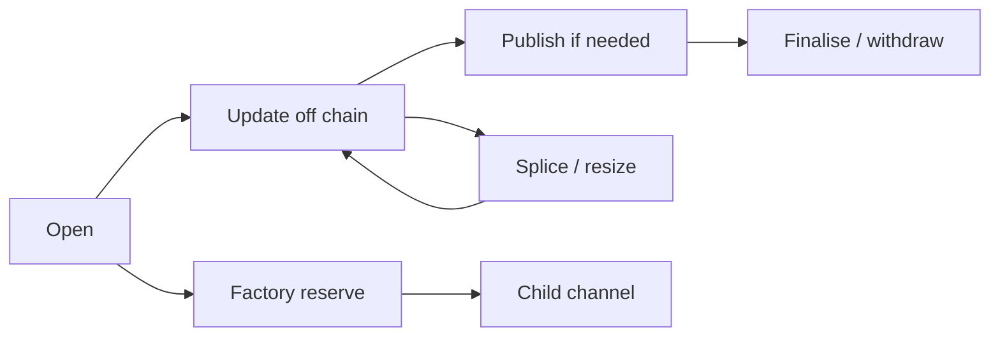

# Morph Channel

Morph Channel is a CKB-native channel prototype. It shows how two people, or a
small factory of people, can move channel state off chain while CKB keeps the
enforceable evidence on chain.

The short version is:

- channel value stays in vault cells;
- the latest enforceable state is carried by a state cell;
- publication fees are paid by sponsor cells, not by channel balances;
- newer signed state can replace older settling state before finalisation;
- factories can hold shared reserve rights and materialise child channels.

This is devnet software and a research implementation, not mainnet
infrastructure. The useful claim today is narrower: the repository contains
executable protocol checks, CKB script tests, local devnet flows, and stateful
acceptance reports for the channel and factory paths it implements.

## Why This Exists

In many channel systems, the object that holds value and the object that proves
the latest state are tightly coupled. CKB lets Morph separate those jobs.


This separation is the core idea from the paper:

- the vault protects user value;
- the state cell says which state can settle that value;
- sponsor funds pay bounded fees for state publication and supersede;
- factory state tracks shared reserve rights without exposing every unrelated
  participant detail on every local action.

The design tries to make disputes boring. A script should be able to answer
simple questions: who signed this state, is it newer, does it match the current
funding context, do the vault outputs match the descriptor, and did any channel
value leak into fees or sponsor change?

## What Works Today

Implemented locally:

- bilateral CKB channels: open, publish, supersede, finalise, and sponsored
  publication;
- CKB and xUDT settlement through the same state/vault authority model;
- splice-in and splice-out, so a channel can be resized without starting over;
- watchtower-style package publication with cursor persistence, policy checks,
  JSONL alerts, and optional webhook alerts;
- conservative factory updates signed by all factory participants;
- factory local exits that materialise child bilateral channels;
- reduced factory paths for bounded rights updates, exits, sparse-Merkle
  updates, and splices, carried by `WitnessEnvelope`;
- devnet smoke and stateful acceptance reports that bind scenarios to real
  transactions, cycle estimates, and expected negative-path failures.

Still not claimed:

- mainnet readiness;
- independent external review;
- long-running multi-operator watchtower evidence;
- production fee and reorganisation measurements;
- release artefact and supply-chain sign-off;
- real-asset value limits.

## Main Business Flows



### Open A Channel

Opening creates a State Cell and a Vault Cell. From the user's point of view,
this is the deposit step: funds move from a normal wallet cell into cells
controlled by channel rules.

### Update Off Chain

Participants exchange signed states. Most updates do not touch CKB. A higher
state number beats a lower one when a dispute reaches the chain.

### Publish If Needed

If cooperation fails, a participant or watchtower can publish a saved package.
The transaction may use sponsor capacity for fees, but sponsor funds do not
become channel value and channel value does not become sponsor change.

### Finalise And Withdraw

After the relative `since` delay, the vault can be spent only against the
current settling State Cell and its settlement descriptor. This is the withdrawal
step.

### Resize With Splice

Splice-in adds value and splice-out removes value while keeping the logical
channel identity. Old watch packages must not be reused after a splice unless
their signed funding context still matches the live state track.

### Use A Factory

A factory groups reserve rights under a Factory State Cell and Factory Vault
Cell. Conservative updates require all participants. Reduced paths are allowed
only when the proof shows that a bounded local right changed and unrelated
rights stayed committed.

## Repository Layout

```text
crates/morph-core      Protocol objects, signing digests, and invariants.
crates/morph-cli       Fixture tooling, package validators, devnet operations,
                       watchtower commands, and report generation.
contracts/             no-std CKB scripts and shared script parsers.
schemas/               Molecule schema draft for the wire format.
docs/                  Devnet, implementation, readiness, and tutorial notes.
scripts/               Devnet, smoke, and environment helpers.
ui/morph-hub           Local Morph operator console for invoices, channels,
                       factories, and watchtower state.
```

Important scripts:

- `morph-state-type`: state-cell progression and signed-state checks;
- `morph-state-lock`: state-cell lock boundary;
- `morph-vault-lock`: vault settlement and splice checks;
- `morph-sponsor-lock`: bounded sponsor fee spending;
- `morph-factory-type`: factory state progression, signatures, reduced proofs,
  exits, and envelope dispatch;
- `morph-factory-vault-lock`: factory reserve conservation;
- `morph-devnet-xudt`: local xUDT issuer/conservation script for devnet tests.

## Quick Start

Run the local checks:

```sh
make ci
cargo test --workspace
cargo clippy --workspace --all-targets -- -D warnings
make fixture-checks
make build-contracts
make contract-tests
```

Check the devnet environment:

```sh
scripts/check-devnet-env.sh
```

Run the local operator console:

```sh
cd ui/morph-hub
npm install
npm run build
cd ../..
cargo run -p morph-cli -- hub serve \
  --listen 127.0.0.1:4617 \
  --pubkey "${MORPH_PUBKEY:?set MORPH_PUBKEY to the local compressed secp256k1 pubkey}" \
  --state-path target/morph-hub/node-state.json \
  --ckb-rpc-url "${MORPH_CKB_RPC:-http://127.0.0.1:18114}" \
  --rotate-auth-token-on-restart
```

Set `MORPH_PUBKEY` to the local 33-byte compressed secp256k1 public key as
66 hex characters without `0x`, matching Fiber's RPC-facing node identity
format. Morph derives its internal 32-byte node id from that pubkey. Then open
`http://127.0.0.1:4617/`. During UI development, `npm run dev` proxies `/api`
to that hub server.

When you have a real watchtower JSONL output from a devnet run, add
`--watch-alert-file "$MORPH_WATCH_ALERT_FILE"`. Without that file, Morph Hub
keeps channel, invoice, peer, and factory rows clearly marked as local Hub state
rather than chain evidence.

Morph Hub is token-first. Start with `--auth-token`, `--auth-token-file`,
`--auth-token-stdin`, `--rotate-auth-token-on-restart`, or
`MORPH_HUB_AUTH_TOKEN`; prefer the file, stdin, or rotate-on-restart modes so
the shared secret is not left in shell history, process listings, or environment
dumps. Rotation is restart-based: start the hub with
`--rotate-auth-token-on-restart`, copy the printed `morph_hub_auth_token=...`
value into the browser unlock prompt, and stop using the old token. Scoped
tokens are supported with
`read,write,restore,sign:<secret>`; omit the prefix only for an all-scope token.
For local development only, `--allow-unauthenticated-loopback` explicitly
restores no-token loopback mode. Direct cross-origin browser access is disabled
unless `--cors-origin` is set to an explicit `http://` or `https://` origin.
Replacing the durable state file through the UI/API is disabled by default; add
`--allow-state-restore` only when you intentionally need that operator recovery
path. Rows shown in the console are labelled as local Hub state unless future
chain evidence fields prove otherwise.

The console keeps itself current while it is open. Explicit
`--allow-unauthenticated-loopback` sessions use `/api/events` server-sent
events; token-protected sessions use authenticated short polling so the bearer
token is never placed in an event-stream URL. When the API requires a token, the
UI accepts it at runtime and stores it only in the browser session.

With a local CKB devnet node running through `scripts/devnet-node.sh`:

```sh
cargo run -p morph-cli --features devnet -- devnet --devnet-only check
cargo run -p morph-cli --features devnet -- devnet --devnet-only mine --blocks 1
cargo run -p morph-cli --features devnet -- devnet --devnet-only deploy-contracts
cargo run -p morph-cli --features devnet -- devnet --devnet-only open-channel
cargo run -p morph-cli --features devnet -- devnet --devnet-only supersede-smoke
cargo run -p morph-cli --features devnet -- devnet --devnet-only xudt-smoke
cargo run -p morph-cli --features devnet -- devnet --devnet-only factory-reduced-rights-smoke
cargo run -p morph-cli --features devnet -- devnet --devnet-only factory-merkle-update-smoke
cargo run -p morph-cli --features devnet -- devnet --devnet-only factory-reduced-exit-smoke
make devnet-smoke
make devnet-e2e
make devnet-stateful-e2e
make fiber-morph-devnet-preflight
make fiber-morph-devnet-acceptance
```

Reports are written under `target/devnet-smoke/` and
`target/devnet-stateful-e2e/`. The `latest` symlink points to the newest
successful run when it is safe to refresh.

The Fiber/Morph acceptance path starts Fiber's local CKB devnet stack, runs
Morph's stateful channel/factory matrix against that CKB RPC, and then runs
Fiber channel acceptance on the same devnet. See
[fiber-morph-devnet-acceptance.md](docs/fiber-morph-devnet-acceptance.md) and
[fiber-morph-devnet-runbook.md](docs/fiber-morph-devnet-runbook.md).

## Common CLI Workflows

Generate and validate factory packages:

```sh
cargo run -p morph-cli -- print-factory-fixture > target/factory-update.json
cargo run -p morph-cli -- validate-factory-package target/factory-update.json --json
cargo run -p morph-cli -- print-factory-reduced-rights-fixture \
  > target/factory-reduced-rights.json
cargo run -p morph-cli -- validate-factory-reduced-rights-package \
  target/factory-reduced-rights.json --json
cargo run -p morph-cli -- print-factory-reduced-exit-fixture \
  > target/factory-reduced-exit.json
cargo run -p morph-cli -- validate-factory-reduced-exit-package \
  target/factory-reduced-exit.json --json
cargo run -p morph-cli -- print-factory-merkle-update-fixture \
  > target/factory-merkle-update.json
cargo run -p morph-cli -- validate-factory-merkle-update-package \
  target/factory-merkle-update.json --json
```

Generate and validate splice packages:

```sh
cargo run -p morph-cli -- print-splice-fixture --kind splice-in \
  > target/splice-in.json
cargo run -p morph-cli -- validate-splice-package target/splice-in.json --json
cargo run -p morph-cli -- print-splice-fixture --kind xudt-splice-out \
  > target/xudt-splice-out.json
cargo run -p morph-cli -- validate-splice-package \
  target/xudt-splice-out.json --json
```

Run watchtower-style publication:

```sh
cargo run -p morph-cli -- print-watch-policy-fixture > target/watch-policy.json
cargo run -p morph-cli -- validate-watch-policy target/watch-policy.json
cargo run -p morph-cli -- print-watch-config-fixture > target/watch-config.json
cargo run -p morph-cli -- validate-watch-config target/watch-config.json
cargo run -p morph-cli --features devnet -- devnet --devnet-only watch-config-once \
  --config target/watch-config.json \
  --private-key-file target/watchtower-owner.key \
  --json
```

Compare smoke reports:

```sh
cargo run -p morph-cli -- devnet-smoke-report --dir target/devnet-smoke/latest
cargo run -p morph-cli -- devnet-smoke-compare \
  --baseline target/devnet-smoke/<old-run> \
  --candidate target/devnet-smoke/<new-run> \
  --fail-on-transaction-set-change \
  --fail-on-status-change \
  --max-abs-total-byte-delta 0 \
  --max-abs-tx-byte-delta 0
```

## Reading Guide

- [Devnet guide](docs/devnet.md): local node setup, smoke paths, and reports.
- [Implementation notes](docs/implementation.md): protocol objects, script
  boundaries, and invariant coverage.
- [Roadmap](docs/roadmap.md): milestone status and deferred work.
- [Mainnet readiness](docs/mainnet-readiness.md): what remains before any
  production or real-assets claim.
- [English tutorial](docs/morph-channel-tutorial.md): a gentler introduction
  with diagrams.
- [Chinese tutorial](docs/morph-channel-tutorial.zh.md): Chinese-language
  walkthrough.

## Maturity

Morph Channel should be read as a serious devnet research implementation. It is
not production infrastructure yet.

The bar for that claim is concrete: independent review, repeated devnet and
testnet runs under realistic fees and reorg conditions, CI-backed release
artefacts, operator runbooks, multi-operator watchtower evidence, and explicit
value limits.
