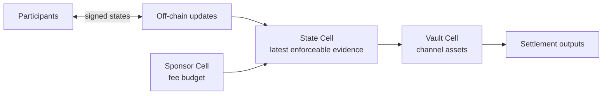
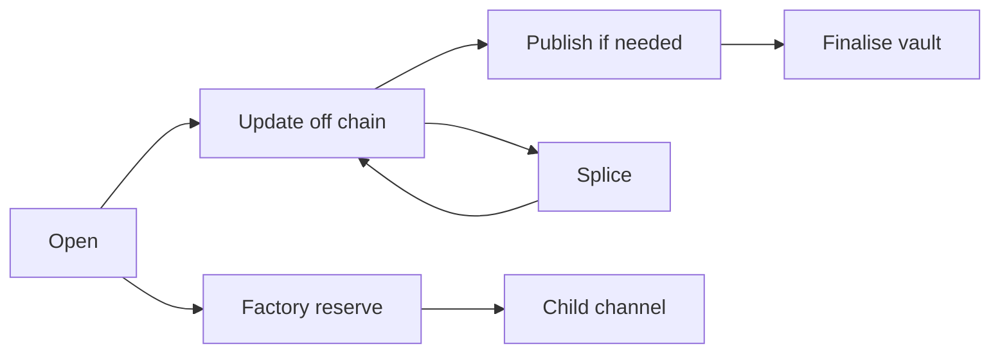

# Morph Channel

Morph Channel is a CKB-native payment-channel and factory-channel prototype.
It explores how channel state, vault assets, sponsored publication, and factory
reserve rights can be represented directly as CKB Cells without changing CKB
consensus.

The repository is not mainnet software. It is a devnet implementation and
research workbench with executable protocol checks, CKB script tests, local
smoke tests, and stateful acceptance reports.

## The Idea

CKB already gives us programmable Cells, lock scripts, type scripts, capacity,
and finality. Morph Channel uses those primitives to build a channel system in
which the chain stores only the latest enforceable evidence, while most state
movement remains off chain.

The core model is simple:



- a **State Cell** is the public pointer to the channel's latest on-chain
  status;
- a **Vault Cell** holds the assets that the channel controls;
- participants sign newer states off chain;
- a participant or watchtower can publish a newer signed state when needed;
- the vault can be finalised only against the current settling state;
- sponsor capacity can pay publication fees without letting the sponsor steal
  channel value;
- factory cells can hold shared reserve rights and materialise child channels
  when a participant exits or repartitions reserve.

The design goal is not to hide all complexity. It is to make each boundary
auditable: who signed, which state is current, which vault assets are conserved,
which reserve right changed, and which script is responsible for rejecting an
invalid transition.

## What Is Implemented

The current factory witness design uses `WitnessEnvelopeV2`. Factory scripts
dispatch by envelope kind, bounded body length, and checked body digest. Some
body and JSON schema names still end in `V1`; those names identify fixed-layout
body schemas, not the current authorisation boundary.

Implemented locally:

- bilateral CKB channels with state publication, supersession, relative-since
  vault finalisation, and sponsored publication;
- CKB+xUDT settlement through the same State Cell and Vault Cell authority
  model;
- splice-in and splice-out flows that move a channel across funding anchors
  while preserving signed state semantics;
- watchtower-style package publication with cursor persistence, policy checks,
  JSONL alerts, and optional webhook alerts;
- conservative factory state updates signed by all factory participants;
- factory local exits that materialise child bilateral channels;
- bounded reduced-rights, reduced-exit, sparse-Merkle update, and reduced-splice
  factory proof bodies carried by `WitnessEnvelopeV2`;
- local devnet smoke reports and stateful acceptance reports that bind protocol
  scenarios to transaction evidence, cycle budgets, and expected negative-path
  failures.

Open release gates remain: external review, mainnet-like fee and reorg
evidence, release/CI supply-chain revalidation, operational runbooks,
multi-operator watchtower evidence, and an explicit value-limit policy.

## Business Flow



### 1. Open A Channel

Alice and Bob create a State Cell and a Vault Cell. The State Cell records the
channel identity, state number, funding anchor, vault-set commitment, settlement
descriptor commitment, and participant authorisation context. The Vault Cell
holds the actual CKB or xUDT assets.

From a user perspective, this is the deposit step: funds become controlled by
channel rules rather than by a normal wallet lock.

### 2. Move State Off Chain

Participants exchange signed state updates. A newer state number supersedes an
older one. Most updates do not touch the chain.

This is the ordinary payment-channel experience: the business state changes
quickly, while the chain is only needed for opening, dispute/publication,
splicing, and final settlement.

### 3. Publish When Necessary

If the channel needs to settle, or if a participant must prove the latest known
state, a signed package can be published to a new State Cell. Sponsor capacity
may pay the transaction fee, but the sponsor script enforces strict budget and
clean-change rules.

Watchtower tooling can monitor confirmed State Cells and publish matching saved
packages. It refuses stale packages after a funding-anchor change, which matters
after splice operations.

### 4. Finalise The Vault

After the required relative `since` window, the Vault Cell can be spent only if
it matches the current settling State Cell and the committed settlement
descriptor. CKB and xUDT settlement paths both check exact recipient and asset
amount semantics.

This is the withdrawal step: channel-controlled assets return to ordinary
recipient cells according to the latest enforceable state.

### 5. Splice Without Restarting The Channel

A splice changes the funding anchor and vault set while preserving the channel's
logical identity and state progression. Splice-in adds assets; splice-out
withdraws assets. The old and new State/Vault pairs are linked by signed
transition evidence.

In business terms, users can resize the channel without closing and reopening
the whole relationship.

### 6. Use A Factory For Many Child Channels

A factory groups reserve rights under a Factory State Cell and Factory Vault
Cell. Conservative updates require all factory participants. Reduced paths prove
that only a bounded touched right changed while the rest of the factory state
remained committed.

Factory exits can materialise child bilateral channels. Factory splice paths
can repartition CKB or xUDT reserve. The current contract-facing witness surface
uses `WitnessEnvelopeV2`, so the scripts first authenticate the envelope and
then parse the specific fixed-layout body.

## Repository Layout

```text
crates/morph-core      Protocol objects, signing digests, and invariants.
crates/morph-cli       Fixture tooling, package validators, devnet operations,
                       watchtower commands, and report generation.
contracts/             no-std CKB scripts and shared script parsers.
schemas/               Molecule schema draft for the wire format.
docs/                  Devnet, implementation, readiness, and tutorial notes.
scripts/               Devnet, smoke, and environment helpers.
```

Important scripts:

- `morph-state-type`: one-live-State-Cell progression and signed state checks;
- `morph-state-lock`: State Cell lock boundary;
- `morph-vault-lock`: vault settlement and splice vault checks;
- `morph-sponsor-lock`: bounded sponsor fee spending;
- `morph-factory-type`: factory state progression, signatures, reduced proofs,
  exits, and envelope dispatch;
- `morph-factory-vault-lock`: factory reserve conservation;
- `morph-devnet-xudt`: local xUDT issuer/conservation script for devnet tests.

## Quick Start

Run the local checks:

```sh
make ci
cargo test --workspace
cargo clippy --workspace --all-targets -- -D warnings
make fixture-checks
make build-contracts
make contract-tests
```

Check the devnet environment:

```sh
scripts/check-devnet-env.sh
```

With a local CKB devnet node running through `scripts/devnet-node.sh`:

```sh
cargo run -p morph-cli -- devnet check
cargo run -p morph-cli -- devnet mine --blocks 1
cargo run -p morph-cli -- devnet deploy-contracts
cargo run -p morph-cli -- devnet open-channel
cargo run -p morph-cli -- devnet supersede-smoke
cargo run -p morph-cli -- devnet xudt-smoke
cargo run -p morph-cli -- devnet factory-reduced-rights-smoke
cargo run -p morph-cli -- devnet factory-merkle-update-smoke
cargo run -p morph-cli -- devnet factory-reduced-exit-smoke
make devnet-smoke
make devnet-e2e
make devnet-stateful-e2e
```

The generated reports live under `target/devnet-smoke/` and
`target/devnet-stateful-e2e/`. The `latest` symlink points to the most recent
successful run when it is safe to refresh.

## Common CLI Workflows

Generate and validate reusable state and factory packages:

```sh
cargo run -p morph-cli -- print-factory-fixture > target/factory-update.json
cargo run -p morph-cli -- validate-factory-package target/factory-update.json --json
cargo run -p morph-cli -- print-factory-reduced-rights-fixture \
  > target/factory-reduced-rights.json
cargo run -p morph-cli -- validate-factory-reduced-rights-package \
  target/factory-reduced-rights.json --json
cargo run -p morph-cli -- print-factory-reduced-exit-fixture \
  > target/factory-reduced-exit.json
cargo run -p morph-cli -- validate-factory-reduced-exit-package \
  target/factory-reduced-exit.json --json
cargo run -p morph-cli -- print-factory-merkle-update-fixture \
  > target/factory-merkle-update.json
cargo run -p morph-cli -- validate-factory-merkle-update-package \
  target/factory-merkle-update.json --json
```

Generate splice packages:

```sh
cargo run -p morph-cli -- print-splice-fixture --kind splice-in \
  > target/splice-in.json
cargo run -p morph-cli -- validate-splice-package target/splice-in.json --json
cargo run -p morph-cli -- print-splice-fixture --kind xudt-splice-out \
  > target/xudt-splice-out.json
cargo run -p morph-cli -- validate-splice-package \
  target/xudt-splice-out.json --json
```

Run watchtower-style publication:

```sh
cargo run -p morph-cli -- print-watch-policy-fixture > target/watch-policy.json
cargo run -p morph-cli -- validate-watch-policy target/watch-policy.json
cargo run -p morph-cli -- print-watch-config-fixture > target/watch-config.json
cargo run -p morph-cli -- validate-watch-config target/watch-config.json
cargo run -p morph-cli -- devnet watch-config-once \
  --config target/watch-config.json \
  --private-key-file target/watchtower-owner.key \
  --json
```

Compare smoke reports:

```sh
cargo run -p morph-cli -- devnet-smoke-report --dir target/devnet-smoke/latest
cargo run -p morph-cli -- devnet-smoke-compare \
  --baseline target/devnet-smoke/<old-run> \
  --candidate target/devnet-smoke/<new-run> \
  --fail-on-transaction-set-change \
  --fail-on-status-change \
  --max-abs-total-byte-delta 0 \
  --max-abs-tx-byte-delta 0
```

## Reading Guide

- [Devnet guide](docs/devnet.md): local node setup, smoke paths, report
  generation, and assertion gates.
- [Implementation notes](docs/implementation.md): protocol objects, script
  boundary, factory witness envelope, and invariant coverage.
- [Roadmap](docs/roadmap.md): milestone status and deferred work.
- [Mainnet readiness](docs/mainnet-readiness.md): what remains before any
  production or real-assets claim.
- [English tutorial](docs/morph-channel-tutorial.md): a gentler introduction
  with diagrams.
- [Chinese tutorial](docs/morph-channel-tutorial.zh.md): Chinese-language
  walkthrough.

## Maturity

Morph Channel should be read as a serious devnet research implementation, not
as production infrastructure. The useful evidence today is local and
executable: invariant tests, CKB script tests, smoke reports, stateful
acceptance reports, and negative-path assertions.

The next maturity step is external validation: independent review, repeated
devnet runs under realistic fee and reorg conditions, CI-backed release
artefacts, operational runbooks, and conservative value limits.
