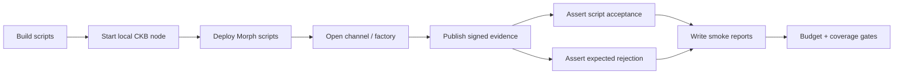
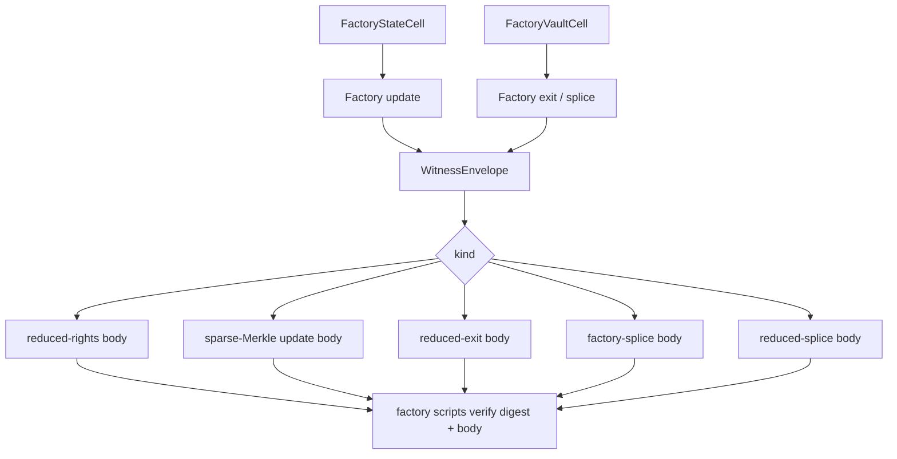
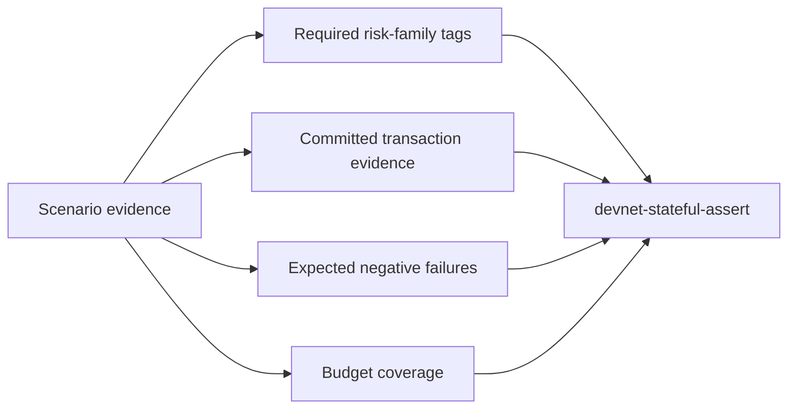

# Devnet Guide

This guide explains how to run Morph Channel on a local CKB devnet, what the
smoke paths prove, where reports are written, and which assertion gates matter.

Morph devnet is not a toy command runner. It is the executable environment used
to check that host-side packages, no-std CKB scripts, RPC transaction builders,
watchtower flows, and negative-path failures all agree with the same protocol
model.

## Devnet At A Glance



The ordinary happy path is:

1. build the CKB scripts;
2. start an isolated local node;
3. deploy Morph scripts;
4. open channel or factory cells;
5. publish signed state, splice, or factory evidence;
6. finalise vaults or materialise child channels;
7. write JSON and Markdown reports;
8. assert hashes, failures, budgets, and coverage.

## Local Node Setup

### Required Tools

| Tool | Why it is needed |
| --- | --- |
| Rust + Cargo | Build crates, CLI, tests, and contract helpers. |
| `riscv64imac-unknown-none-elf` target | Build no-std CKB scripts. |
| CKB node binary | Run the isolated local devnet. |
| `jq` | Shell smoke scripts use it to inspect JSON reports. |

Check the local environment:

```sh
scripts/check-devnet-env.sh
```

If the CKB binary is not on `PATH`, set `CKB_BIN`:

```sh
CKB_BIN=/path/to/ckb scripts/check-devnet-env.sh
```

### Start The Node

```sh
scripts/devnet-node.sh
```

Default behaviour:

```text
node directory: target/devnet/node
RPC port:       18114
P2P port:       local generated port
RPC module:     IntegrationTest enabled for local mining
assembler:      local secp256k1 dev lock
```

Common overrides:

```sh
CKB_BIN=/path/to/ckb scripts/devnet-node.sh
CKB_DIR=target/devnet/custom-node scripts/devnet-node.sh
RPC_PORT=18124 P2P_PORT=18125 scripts/devnet-node.sh
```

The default block assembler argument is for isolated devnet mining only. Do not
reuse it for any production or real-assets environment.

## First Manual Run

With the node running in another shell:

```sh
cargo run -p morph-cli -- devnet check
cargo run -p morph-cli -- devnet mine --blocks 1
cargo run -p morph-cli -- devnet wait-tip 1 --timeout-secs 30
cargo run -p morph-cli -- devnet deploy-contracts --json
cargo run -p morph-cli -- devnet open-channel --json
cargo run -p morph-cli -- devnet supersede-smoke --json
```

The manual sequence proves that the CLI can talk to the node, mine blocks,
deploy current scripts, open a channel, and publish a newer signed state.

## Smoke Paths

The smoke suite is the normal local regression path:

```sh
make devnet-smoke
```

It runs local checks, builds scripts, drives the devnet node, executes positive
and negative scenarios, and writes a report tree under:

```text
target/devnet-smoke/<timestamp>/
```

The important smoke families are:

| Family | What it proves |
| --- | --- |
| Deployment | Current local ELFs match deployed script data hashes. |
| Channel open | State/Vault/Sponsor cells can be created on devnet. |
| State publication | Signed higher states can be published with sponsor capacity. |
| Vault finalisation | Vault settlement is tied to the current settling State Cell. |
| Negative attacks | Wrong descriptors, immature finalise, budget overrun, competing spend, and fake state shapes fail as expected. |
| CKB+xUDT | Token-bearing vaults settle exact CKB and xUDT balances. |
| Splice | Funding anchors and vault sets can change with signed transition evidence. |
| Factory | Factory state, reserve, local exit, reduced rights, Merkle update, reduced exit, and reduced splice paths are exercised. |
| Watchtower | Saved packages can be published, stale packages are rejected after splice, and alert channels emit evidence. |

### Factory Smoke Shape



## Real Devnet E2E

For release-style local evidence, use:

```sh
scripts/devnet-e2e.sh
```

This starts a fresh CKB devnet, builds current scripts, runs the on-chain smoke
suite, and applies the smoke budget profile. By default it looks for the CKB
source tree in `../ckb`.

Useful overrides:

```sh
CKB_SOURCE_DIR=../ckb scripts/devnet-e2e.sh
CKB_BIN=../ckb/target/debug/ckb scripts/devnet-e2e.sh
RPC_PORT=18124 P2P_PORT=18125 RUN_ID=local-evidence scripts/devnet-e2e.sh
BUILD_CONTRACTS=0 scripts/devnet-e2e.sh
KEEP_NODE=1 scripts/devnet-e2e.sh
```

Important artefacts:

```text
target/devnet-e2e/<run>/manifest.txt
target/devnet-e2e/<run>/logs/ckb-node.log
target/devnet-e2e/<run>/logs/build-contracts.log
target/devnet-e2e/<run>/logs/devnet-smoke.log
target/devnet-e2e/<run>/smoke/summary.json
target/devnet-e2e/<run>/smoke/summary-budget-check.json
```

## Stateful Acceptance

Run:

```sh
make devnet-stateful-e2e
```

This creates scenario records under:

```text
target/devnet-stateful-e2e/<run>/scenarios/
```

The stateful layer asks a different question from smoke testing:



For factory work, stateful acceptance is deliberately stricter than merely
referencing smoke artefacts. `devnet-stateful-assert` rejects a scenario set
unless the factory lifecycle, factory splice, one-sided/extreme factory cases,
and factory negative xUDT paths are named in the scenario-level required
committed checks or expected failures. This covers open/update, child
materialisation/finalisation, reduced-rights, sparse-Merkle updates, reduced
CKB and xUDT exits, conservative and reduced CKB/xUDT splices, asymmetric CKB
variants, one-sided xUDT variants, and exact expected factory xUDT rejection
errors.

Generate or assert a report:

```sh
cargo run -p morph-cli -- devnet-stateful-report \
  --dir target/devnet-stateful-e2e/latest/scenarios \
  --audit-profile docs/devnet-audit-profile.example.json

cargo run -p morph-cli -- devnet-stateful-assert \
  --dir target/devnet-stateful-e2e/latest/scenarios \
  --audit-profile docs/devnet-audit-profile.example.json \
  --budget-profile docs/devnet-stateful-budget.example.json
```

## Report Generation

Smoke reports can be regenerated without replaying devnet:

```sh
cargo run -p morph-cli -- devnet-smoke-report \
  --dir target/devnet-smoke/<run>
make smoke-report
```

The report writer produces:

```text
summary.md
summary.json
summary-check.json
summary-budget-check.json
```

The summaries include:

- deployed script outpoints and data hashes;
- local script hash comparison;
- transaction cycles and byte sizes;
- block numbers and statuses;
- expected negative-path script errors;
- watchtower JSONL alert events;
- factory proof profiles and witness sizes;
- budget pass/fail state.

## Assertion Gates

### Smoke Assertion

```sh
cargo run -p morph-cli -- devnet-smoke-assert \
  --dir target/devnet-smoke/<run>
```

This gate verifies that the smoke run contains the required positive evidence,
negative failures, deployed scripts, local binary hash matches, watchtower
events, and factory evidence packages.

Add budget checks:

```sh
cargo run -p morph-cli -- devnet-smoke-assert \
  --dir target/devnet-smoke/<run> \
  --budget-profile docs/devnet-smoke-budget.example.json
```

### Smoke Comparison

```sh
cargo run -p morph-cli -- devnet-smoke-compare \
  --baseline target/devnet-smoke/<old-run> \
  --candidate target/devnet-smoke/<new-run> \
  --fail-on-transaction-set-change \
  --fail-on-status-change \
  --max-abs-total-byte-delta 0 \
  --max-abs-tx-byte-delta 0
```

Use comparison when you want to prove a candidate run did not silently change
the transaction set, statuses, or byte/cycle envelopes relative to a baseline.

## Package And Watchtower Commands

Generate reusable packages:

```sh
cargo run -p morph-cli -- print-factory-fixture > target/factory-update.json
cargo run -p morph-cli -- validate-factory-package target/factory-update.json --json
cargo run -p morph-cli -- print-factory-reduced-rights-fixture \
  > target/factory-reduced-rights.json
cargo run -p morph-cli -- validate-factory-reduced-rights-package \
  target/factory-reduced-rights.json --json
cargo run -p morph-cli -- print-splice-fixture --kind splice-in \
  > target/splice-in.json
cargo run -p morph-cli -- validate-splice-package target/splice-in.json --json
```

Run one watchtower config pass:

```sh
cargo run -p morph-cli -- print-watch-policy-fixture > target/watch-policy.json
cargo run -p morph-cli -- validate-watch-policy target/watch-policy.json
cargo run -p morph-cli -- print-watch-config-fixture > target/watch-config.json
cargo run -p morph-cli -- validate-watch-config target/watch-config.json
cargo run -p morph-cli -- devnet watch-config-once \
  --config target/watch-config.json \
  --private-key-file target/watchtower-owner.key \
  --json
```

Run a bounded foreground service:

```sh
cargo run -p morph-cli -- devnet watch-config-service \
  --config target/watch-config.json \
  --private-key-file target/watchtower-owner.key \
  --health-file target/watchtower-health.json \
  --stop-file target/watchtower.stop \
  --json
```

Private keys are deliberately kept out of watchtower config files. Prefer
`--private-key-file` or `MORPH_DEVNET_PRIVATE_KEY_FILE` over shell-history
arguments.

## Troubleshooting

| Symptom | Likely cause | Fix |
| --- | --- | --- |
| RPC check fails | Node not running or wrong port. | Start `scripts/devnet-node.sh` and set `MORPH_CKB_RPC` if needed. |
| Contract build fails | Missing RISC-V target. | Install `riscv64imac-unknown-none-elf` or use `CONTRACT_CARGO='cargo +nightly'`. |
| Smoke assertion hash mismatch | Deployed scripts differ from local ELFs. | Rebuild contracts and rerun deployment/smoke. |
| Stale package rejected after splice | Saved package funding anchor no longer matches current State Cell. | Generate a package against the post-splice State/Vault pair. |
| Budget check fails | Transaction shape or cycles changed. | Inspect `summary.json`, then decide whether the change is justified and update the budget profile deliberately. |
