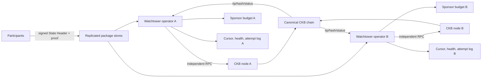
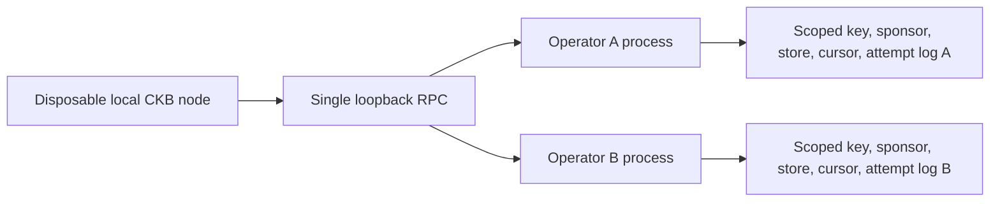
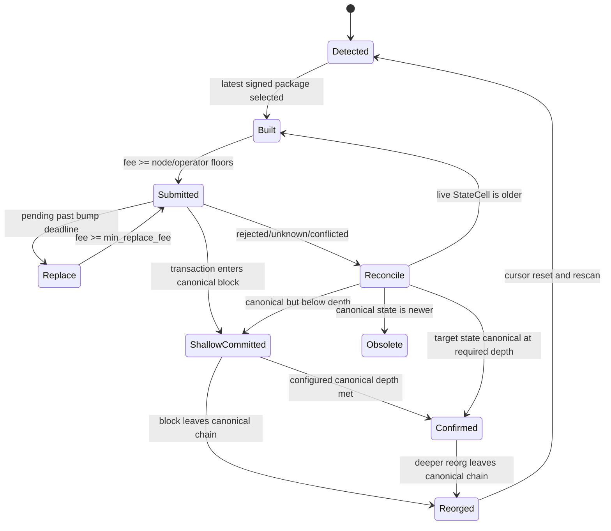

# Publication reliability architecture

## Production target topology

The repository's deterministic rehearsal does not instantiate that topology. It
uses one disposable node and one loopback RPC on one host while preserving
operator-scoped identities, keys, budgets, stores, cursors, profiles, and logs:

## Publication state machine

