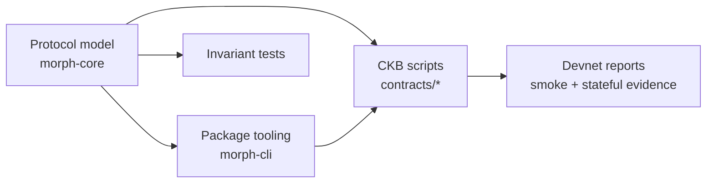
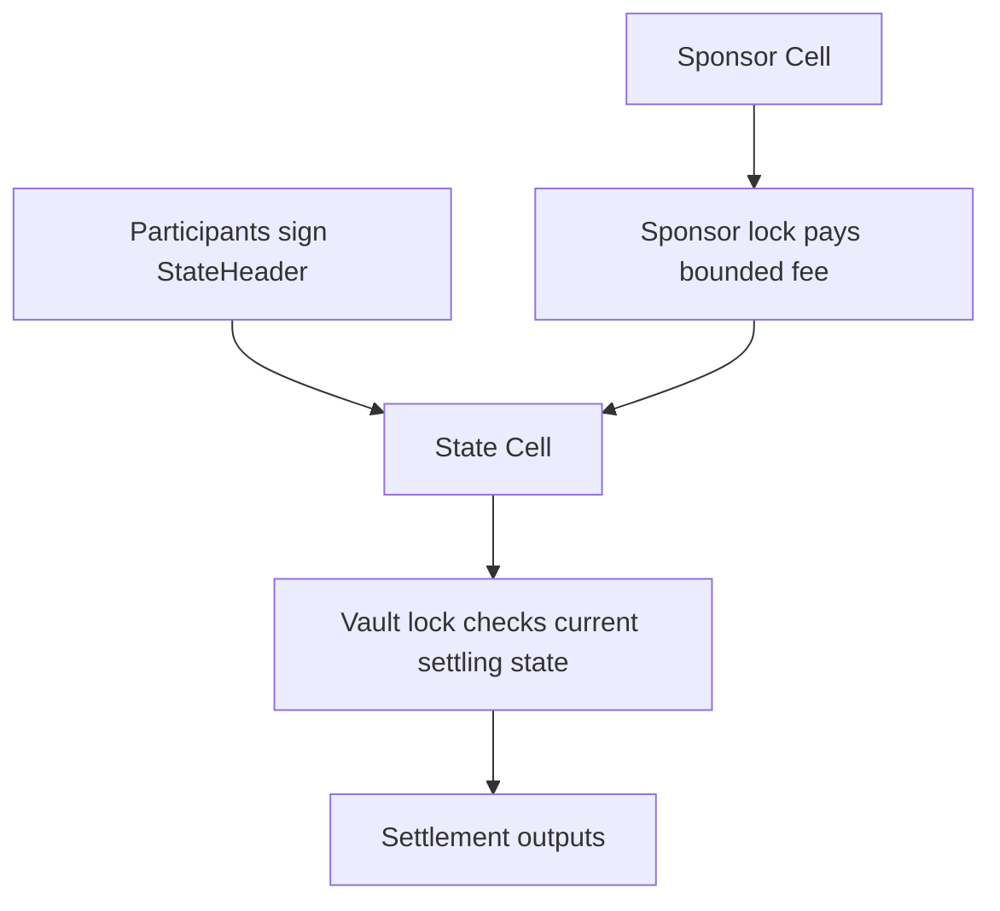
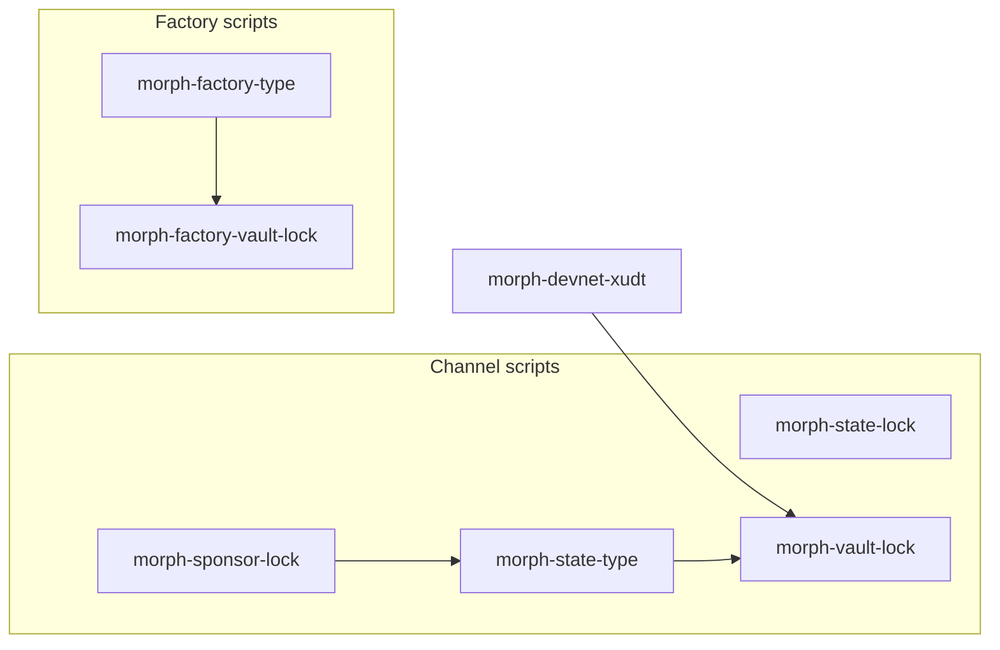
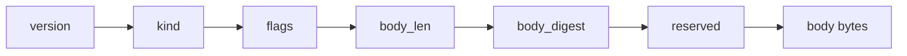
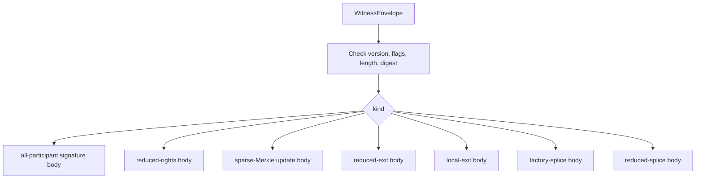
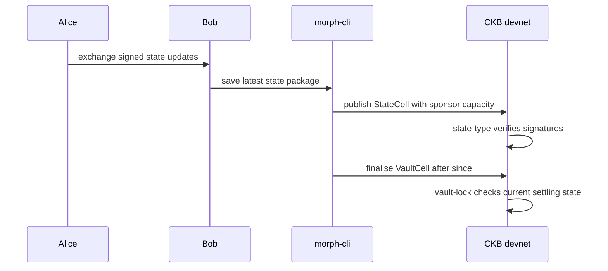

# Implementation Notes

These notes describe the current Morph Channel implementation: protocol
objects, script boundary, factory witness envelope, and invariant coverage.

The important point is that the repository has one protocol story expressed in
three places:



`morph-core` defines the executable model. `morph-cli` turns model objects into
reviewable packages and devnet transactions. The CKB scripts enforce the narrow
on-chain boundary. Reports prove that those layers agree on real local
transactions.

## Security Boundaries

Morph Channel splits authority into three boundaries:

| Boundary | Owner | What it protects |
| --- | --- | --- |
| State authority | Participant signatures | Which state number and settlement descriptor are current. |
| Value authority | Vault scripts | Whether channel-owned CKB/xUDT can be released. |
| Fee authority | Sponsor scripts and operator policy | Whether sponsor capacity may pay publication costs. |



Sponsor capacity is not channel value. Sponsor scripts can help publish a
state, but they cannot rewrite vault settlement or drain participant assets.

## Protocol Objects

| Object | Where it lives | Role |
| --- | --- | --- |
| `StateHeader` | script-common, CLI, core | Signed channel state header with funding epoch, funding anchor, vault-set commitment, state number, phase, and settlement descriptor commitment. |
| `BilateralSignatureWitness` | script-common | Two sorted participant public keys and signatures over the state digest. |
| `SpliceStateTransitionWitness` | script-common, CLI | Bounded body proving an old funding anchor can move to a new funding anchor. |
| `FactoryStateHeader` | script-common, CLI | Factory state pointer: factory id, update number, participant commitment, rights roots, and reserve context. |
| `FactoryRight` | script-common, core, CLI | Fixed-layout representation of a participant right such as balance or reserve claim. |
| `WitnessEnvelope` | script-common, CLI, factory scripts | Factory authorisation envelope: kind, flags, body length, and body digest. |
| `SponsorPolicy` | script-common, CLI | Script-level sponsor fee policy. |

Names ending in `current` usually identify a fixed-layout body schema. They are not
a claim that the current factory witness boundary is the old current boundary.

In the current devnet profile, `funding_anchor` means the signed funding anchor
identity. It is derived in a Type-ID-style way from the first funding input and
the State Cell output index, and it is not a live output locator. This is the
devnet funding-anchor profile; a mainnet-track profile should add live Fund Cell
uniqueness checking before treating the anchor as deployment-grade identity.

Tooling derives `funding_context_id = H("CKB_MORPH_FUNDING_CONTEXT",
chain_id, channel_id, funding_anchor, vault_set_commitment)` from the signed
State Header context. This identifier is an integration and audit key for the
current funding context. It is not an additional consensus field, and it does
not replace the current signed `funding_epoch` semantics.

The current public mode surface is intentionally narrow. Host code names the
implemented modes `BilateralPlain` and `FactoryProof`; the signing and fixed
wire profile uses mode bytes `1` and `2`. These correspond to the paper's
current `bilateral_plaintext` profile and the implemented factory
commitment/proof profile. Directly funded initial states use mode `1` and must
carry bilateral consent. Child states materialised by a Factory exit use mode
`2` and must carry an exact local/reduced-exit envelope; the mode is preserved
when the child later advances under its bilateral participant signatures.
Bilateral commitment mode is reserved and is not emitted by current package or
devnet flows.

The host `Phase` enum is wider than the on-chain State type phase byte. Current
State scripts accept only `Active` and `Settling`; `Funding` and `Closed` are
local lifecycle labels used by the host node and Hub after opening and after
finalisation. Factory progression is tracked by `FactoryStateHeader.update_number`,
not by a `Phase::FactoryActive` value.

Initial funding approval is enforced on chain. In addition to canonical anchor
derivation, active phase, state number zero, lock/type binding, and capacity
shape, the funding input carries a bilateral signature witness over the complete
initial `StateHeader`. This binds the descriptor, asset registry, challenge
policy, participants, and materialised Vault before the channel exists. The
State type also requires exactly one transaction output whose lock, type,
capacity, and data hash to `vault_materialisation_root`; missing or ambiguous
Vault materialisation is rejected.

Initial Factory creation follows the same rule: the canonical factory-id input
carries a full Factory signature envelope over update zero. Reduced or local
proof kinds cannot be used to authorise creation. Splice-created successor
channels continue to use the separately signed splice bridge instead of a
second redundant initial-state signature.

## Script Boundary



### Channel Scripts

`morph-state-type` owns State Cell progression. It accepts canonical initial
state creation, newer signed state publication, settling progression, and the
State Cell side of splice transitions.

`morph-state-lock` keeps State Cell spending tied to the expected state type
script. Transition rules remain in the type script.

`morph-vault-lock` owns channel value. It finalises only against an authentic
current settling State Cell with a matching descriptor commitment and matured
relative `since`. It also verifies the vault side of splice transitions.
The current bilateral finalisation profile is atomic: it consumes the committed
vault value and does not create terminal receipt Cells.
Cooperative close is not part of the current State type, vault contract, CLI,
host operation taxonomy, or devnet execution profile.

`morph-sponsor-lock` pays only bounded publication fees for admitted channel
state numbers and clean sponsor change.
It does not sponsor funding, finalisation, splice, materialisation, or
cooperative close transactions in the current profile.
The v1 devnet operator default is `min_state_number=1` and
`max_state_number=2^20`; stateful reports flag sponsor policies wider than that
audited default window.
Sponsor policies do not carry a script-level expiry field in the current wire
profile. Finite sponsor windows are operator/watchtower policy, not a
sponsor-lock consensus rule.

### Factory Scripts

`morph-factory-type` owns one-live-FactoryStateCell progression. It verifies
conservative full-participant signatures, local-exit evidence, reduced-rights
proofs, sparse-Merkle updates, reduced exits, factory splices, and
reduced-splice bodies.
Value-bearing factory materialisation consumes and recreates the parent Factory
State Cell with updated roots; read-only `unchanged_reference` materialisation
is not part of the current conservative contract profile.

`morph-factory-vault-lock` owns factory reserve conservation. It ensures a
factory exit or splice changes the FactoryVaultCell exactly as the factory
evidence permits.

The current executable Factory signature profile is deliberately bilateral:
exactly two participant identifiers/public keys sign conservative updates.
Rights trees can contain many typed rights, but they do not make the signer set
dynamic. Host and Hub records reject any other participant count so they cannot
display a Factory that the deployed scripts cannot authorise. Larger signer
sets remain a future wire-profile upgrade; this limitation does not remove the
Factory shared-reserve or child-materialisation model.

### Factory Local Exit Lifecycle

Factory local-exit evidence is one-shot evidence for materialising a child
channel from factory reserve rights. The embedded child State header must be
`state_number=0` and `Active`: the factory transition creates the child channel's
initial enforceable state, after which ordinary child-channel publish,
supersede, splice, and finalise rules take over. Later child states are not
authorised through another local-exit proof; they are authorised by the child
channel's own participant signatures and state-number progression.

The factory type script does not reconstruct the child participants from the
materialised output. The binding is indirect and signed: the local-exit or
reduced-exit evidence commits the exact child State header, including its
`participants_commitment`, settlement descriptor commitment, descriptor version,
lock hash, and vault shape. `morph-factory-type` then requires the output State
Cell bytes to equal that committed header, while the child State type enforces
the participant signature set for later state progression.

Ordinary supersede may advance state number, phase, and the participant-signed
settlement descriptor commitment, but preserves the descriptor version and
materialised Vault root as funding context. Splice has a separate
`state_context_matches_splice_next` rule for the old/new funding-anchor bridge
and is the only transition that may replace the materialised Vault root, while
additionally binding the successor payload to the signed splice header.

## Resolution And Packages

The paper's `ResolvedStateContext` is an audit abstraction. The implementation
does not allocate one shared Rust struct with that name; it resolves commitments
at the boundary that needs them:

- fixed-layout State Header and witness parsers live in `morph-script-common`;
- `morph-state-type` verifies the State Cell progression context and
  participant signatures;
- `morph-vault-lock` parses descriptor witnesses and checks settlement outputs
  against the committed descriptor;
- `morph-sponsor-lock` checks the publication State type hash and bounded
  sponsor policy;
- `morph-factory-type` and `morph-factory-vault-lock` resolve factory envelopes,
  local-exit descriptors, rights proofs, and vault descriptors for the admitted
  factory branch.

The bilateral `StoredStatePackage` used by the CLI stores the signed State
Header bytes, bilateral signature witness bytes, channel id, funding anchor,
derived funding context id, state number, signing digest, source State
outpoint, and descriptor commitment/version metadata. It validates signatures
and metadata before write and read. Latest-package selection is by channel id
and state number, while watchtower re-anchor handling prefers the derived
funding context id and falls back to the funding anchor for older package
stores. The broader paper `StatePackage` object is the protocol requirement for
arbitrary representation profiles; the current bilateral devnet package is the
implemented plaintext profile.

## Factory Witness Envelope

Factory authorisation uses `WitnessEnvelope`.



The scripts verify the envelope first, then dispatch by `kind`.



This design separates the public authorisation surface from body schemas. The
body may remain fixed-layout while the outer witness explicitly states which
factory path is being authorised.

## Channel Business Flow In Code



The same pattern appears in tests and devnet smokes: construct evidence,
publish evidence, assert that scripts accept the valid shape and reject the
attack-shaped variants.

## Invariant Coverage

| Risk | Representative coverage |
| --- | --- |
| Stale state publication | `rejects_stale_or_equal_state_number`, state type negative tests. |
| Signature forgery | host invariant tests, script-common signature tests, state/factory script tests. |
| Vault settlement drift | vault-lock tests and devnet finalisation smokes. |
| State carrier capacity leakage | `rejects_state_carrier_capacity_leakage`. |
| Sponsor fee drain | sponsor-lock budget and clean-change tests. |
| Fake StateHeader bytes | script tests require authentic State Cell type identity. |
| Splice value loss | splice invariant tests, script bridge tests, devnet splice negative smokes. |
| Factory right interference | reduced-rights and sparse-Merkle update tests. |
| Reserve release mismatch | reduced-exit host, script, and devnet smoke coverage. |
| Witness envelope tamper | `WitnessEnvelope` parser and factory script negative tests. |

The executable audit matrix is in [audit-matrix.md](audit-matrix.md). The
paper-to-implementation alignment audit is tracked in
[paper-implementation-audit.md](paper-implementation-audit.md). Devnet assertion
gates are described in [devnet.md](devnet.md).

## Where To Inspect The Code

```text
crates/morph-core/src/types.rs          protocol structs
crates/morph-core/src/hash.rs           signing and commitment domains
crates/morph-core/src/validation.rs     host-side invariants
contracts/morph-script-common/src/lib.rs fixed-layout parsers and verifiers
contracts/morph-state-type/src/main.rs  State Cell rules
contracts/morph-vault-lock/src/main.rs  Vault rules
contracts/morph-factory-type/src/main.rs Factory State rules
contracts/morph-factory-vault-lock/src/main.rs Factory reserve rules
crates/morph-cli/src/devnet.rs          local devnet transaction paths
crates/morph-cli/src/*packages.rs       reusable package encoders/validators
```

## Design Posture

The implementation is deliberately conservative:

- fixed-layout bodies are used where CKB scripts need simple bounded parsing;
- `WitnessEnvelope` provides the current factory authorisation boundary;
- reduced factory paths prove one narrow local change, not arbitrary global
  mutation;
- devnet evidence is local and executable, but not a mainnet readiness claim.

The production-readiness gap is tracked in
[mainnet-readiness.md](mainnet-readiness.md).
