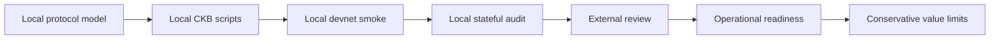
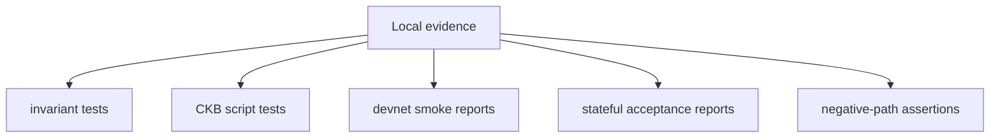
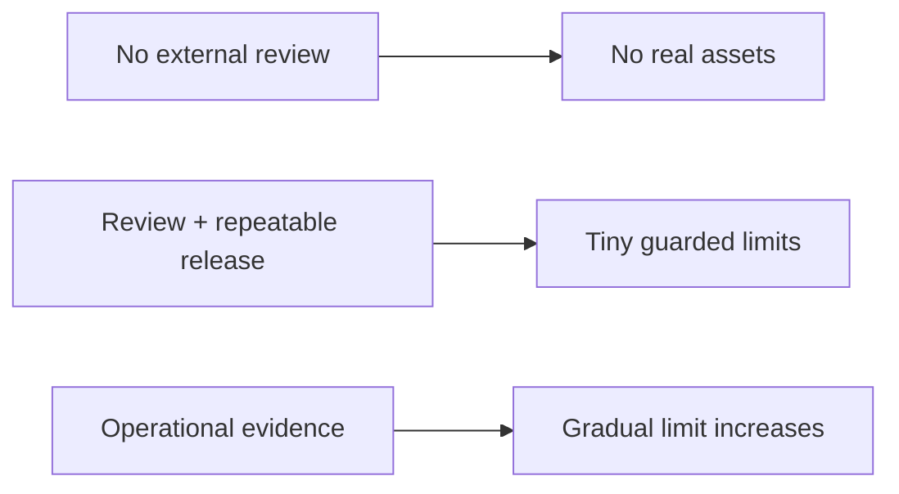

# Mainnet Readiness

Morph Channel is not mainnet-ready and is not production real-assets software.
This document explains what remains before any responsible production claim.

## Current Position

The repository currently has local executable evidence through `morph-core`
tests, CKB script tests, smoke reports, and stateful acceptance reports. That
is necessary evidence, but it is not enough for mainnet.

## Readiness Gates

| Gate | Required evidence | Current status |
| --- | --- | --- |
| Independent protocol review | External review of state, vault, sponsor, splice, and factory rules. | Open. |
| Independent script review | Review of no-std CKB parsing, cell selection, since handling, and error paths. | Open. |
| Exact Vault provenance | Activation/rotation binds every bilateral and Factory Vault to its exact CKB OutPoint; clone/substitution negatives pass. | Implemented and locally verified; independent review/migration policy remain open. |
| Factory state sovereignty | FactoryState uses the type-bound Morph StateLock; participant/reduced proofs, rather than a fee payer's secp lock, authorise state transitions. | Implemented for newly created factories; the release policy explicitly requires legacy owner-locked devnet factories to settle and be recreated. Independent review remains open. |
| Factory child provenance | A FactoryProof child StateType commits and verifies the exact input FactoryType script hash that authorises materialisation. | Implemented with a CKB-VM negative test; pre-fix devnet children require recreation and independent review remains open. |
| State-carrier conservation | Ordinary State/Factory updates preserve carrier capacity exactly; activation consumes exactly 10,000 shannons; splice/exit successors reserve exactly that amount. | Implemented and covered by CKB-VM negative tests; independent review remains open. |
| Timed payment commit | The bilateral backend rejects commits before preparation and at/after the signed intent expiry. | Implemented in the host boundary; pending conditional-payment force-close remains open. |
| Morph-backed routed edge | A provider-neutral edge and minimal Fiber hook prove real routed/MPP traffic against live Morph materialisation and failure callbacks. | Open; current real Fiber route is not Morph-backed. |
| RGB++ proof and reorg pipeline | Bitcoin proof, CKB binding/leap, confirmation, quarantine, and rollback evidence for admitted RGB++ assets. | Open. |
| Reproducible release artefacts | CI-built script ELFs, data hashes, signed release manifests, and clean rebuild instructions. | Implemented for the bounded Factory v1.0 devnet candidate: committed CKB data-hash manifest, deterministic bundle, CI upload, and main-branch provenance attestation. A successful clean main-branch run and independent rebuild remain required evidence. |
| Supply-chain warning closure | Remove or formally review current upstream warnings (`memmap2` and `lru 0.7` through dev-only `ckb-testtool` and unmaintained `proc-macro-error2`). | Open; policy gates pass with narrow reviewed waivers, but upstream warnings remain. |
| Mainnet-like fee evidence | Repeated runs under realistic fee pressure and transaction-size budgets. | Open. |
| Reorg and delay evidence | Watchtower and publication behaviour under delayed observations and chain reorg scenarios. | Canonical cursor-hash verification, critical reorg alerting, context reset, and rescan-from-floor are implemented and unit tested. Repeated induced-reorg and public-network delay evidence remains open. |
| Multi-operator watchtower evidence | At least two independent operators following documented procedures. | Open. |
| Operational runbooks | Key handling, package retention, alert response, rollback, incident response, and upgrade procedures. | Implemented for the controlled-devnet candidate with a repository-side rehearsal; independent operator rehearsal remains open. |
| Value-limit policy | Explicit caps tied to evidence level and operator readiness. | Implemented as a machine-checked, dated, no-real-assets devnet envelope. Any public testnet/mainnet or real-asset policy remains open. |

## What Local Evidence Already Covers

Local evidence covers:

- participant signatures over current state;
- monotonic State Cell progression;
- authentic State Cell requirements for vault finalisation;
- per-cell sponsor budget, exact fee attribution, and clean-change boundaries;
- CKB and CKB+xUDT settlement descriptors;
- splice funding-anchor and vault-set transitions;
- factory full-participant signatures;
- exact bilateral/Factory Vault content commitments plus canonical OutPoint
  activation, preservation, rotation, and clone-substitution negatives;
- bounded reduced-rights, sparse-Merkle, reduced-exit, factory-splice, and
  reduced-splice proof bodies carried by `WitnessEnvelope`;
- type-bound FactoryState locking, with fee signatures isolated to independent
  fee inputs and reduced exit constructible from the counterparty public key;
- FactoryProof child State creation bound to the exact authorising FactoryType
  input identity;
- exact State/Factory carrier-capacity deltas across ordinary update,
  activation, splice, and exit paths;
- expected failure paths for malformed or attack-shaped transactions.

## What Local Evidence Does Not Prove

Local devnet evidence does not prove:

- real network fee behaviour;
- mempool and propagation behaviour under adversarial timing;
- long-running watchtower operations;
- operational safety of key custody;
- reproducibility of release artefacts in a separate independent environment;
- correctness under independent review;
- independent validation of the implemented exact-OutPoint activation profile;
- migration of legacy owner-locked devnet FactoryState cells (they cannot be
  upgraded in place because lock continuity correctly rejects the change);
- real Morph-backed external-edge operation inside a routing provider;
- production RGB++ SPV/leap/reorg handling;
- safe value limits for real users.

## Minimum Production Checklist

Before any production or real-assets claim, the project needs:

1. a reviewed release candidate commit;
2. reproducible CKB script binaries and script hash manifest;
3. clean CI results for Rust tests, contract tests, smoke assertions, stateful
   assertions, clippy, and formatting;
4. external review notes with all critical findings closed;
5. repeated devnet/testnet runs with fee and delay profiles;
6. watchtower runbooks and at least one independent operator rehearsal;
7. documented incident response and emergency stop procedure;
8. value caps that match the evidence level;
9. clear user-facing risk disclosure.

## Value-Limit Posture

The correct default is no real asset exposure. Value limits should increase
only when evidence improves, and every increase should be tied to a dated
release, review record, operator procedure, and observed run history.

The current bounded policy is
[`preproduction-envelope.md`](preproduction-envelope.md), backed by the
machine-checked JSON envelope and exact contract manifest under
`release/factory-v1.0-preproduction/`. It permits only controlled devnet and
prohibits real assets.

## Go / No-Go Summary

| Question | Go condition |
| --- | --- |
| Can the current repo be used for local research? | Yes. |
| Can it be used for devnet evidence generation? | Yes. |
| Can it be used for mainnet real assets today? | No. |
| What is the next readiness step? | Successful CI provenance for the candidate, external review, independent operator rehearsal, and repeated induced-reorg/fee evidence. |
