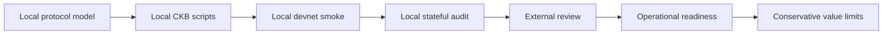
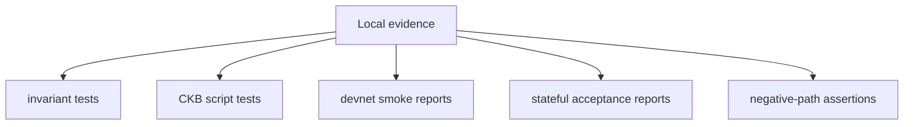
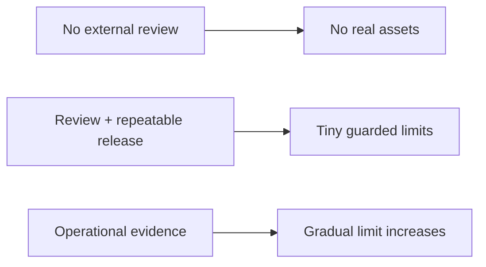

# Mainnet Readiness

Morph Channel is not mainnet-ready and is not production real-assets software.
This document explains what remains before any responsible production claim.

## Current Position

The repository currently has local executable evidence through `morph-core`
tests, CKB script tests, smoke reports, and stateful acceptance reports. That
is necessary evidence, but it is not enough for mainnet.

## Readiness Gates

| Gate | Required evidence | Current status |
| --- | --- | --- |
| Independent protocol review | External review of state, vault, sponsor, splice, and factory rules. | Open. |
| Independent script review | Review of no-std CKB parsing, cell selection, since handling, and error paths. | Open. |
| Exact Vault provenance | Participant-signed activation/rotation binds every bilateral and Factory Vault to its exact CKB OutPoint; clone/substitution negatives pass. | Open; current roots bind content only. |
| Morph-backed routed edge | A provider-neutral edge and minimal Fiber hook prove real routed/MPP traffic against live Morph materialisation and failure callbacks. | Open; current real Fiber route is not Morph-backed. |
| RGB++ proof and reorg pipeline | Bitcoin proof, CKB binding/leap, confirmation, quarantine, and rollback evidence for admitted RGB++ assets. | Open. |
| Reproducible release artefacts | CI-built script ELFs, data hashes, signed release manifests, and clean rebuild instructions. | Open. |
| Mainnet-like fee evidence | Repeated runs under realistic fee pressure and transaction-size budgets. | Open. |
| Reorg and delay evidence | Watchtower and publication behaviour under delayed observations and chain reorg scenarios. | Open. |
| Multi-operator watchtower evidence | At least two independent operators following documented procedures. | Open. |
| Operational runbooks | Key handling, package retention, alert response, rollback, incident response, and upgrade procedures. | Open. |
| Value-limit policy | Explicit caps tied to evidence level and operator readiness. | Open. |

## What Local Evidence Already Covers

Local evidence covers:

- participant signatures over current state;
- monotonic State Cell progression;
- authentic State Cell requirements for vault finalisation;
- sponsor budget and clean-change boundaries;
- CKB and CKB+xUDT settlement descriptors;
- splice funding-anchor and vault-set transitions;
- factory full-participant signatures;
- exact FactoryVault content commitments on creation, exits, and splices;
- bounded reduced-rights, sparse-Merkle, reduced-exit, factory-splice, and
  reduced-splice proof bodies carried by `WitnessEnvelope`;
- expected failure paths for malformed or attack-shaped transactions.

## What Local Evidence Does Not Prove

Local devnet evidence does not prove:

- real network fee behaviour;
- mempool and propagation behaviour under adversarial timing;
- long-running watchtower operations;
- operational safety of key custody;
- reproducibility of release artefacts in a separate environment;
- correctness under independent review;
- resistance to byte-identical Vault clone/substitution until exact OutPoint
  activation is implemented;
- real Morph-backed external-edge operation inside a routing provider;
- production RGB++ SPV/leap/reorg handling;
- safe value limits for real users.

## Minimum Production Checklist

Before any production or real-assets claim, the project needs:

1. a reviewed release candidate commit;
2. reproducible CKB script binaries and script hash manifest;
3. clean CI results for Rust tests, contract tests, smoke assertions, stateful
   assertions, clippy, and formatting;
4. external review notes with all critical findings closed;
5. repeated devnet/testnet runs with fee and delay profiles;
6. watchtower runbooks and at least one independent operator rehearsal;
7. documented incident response and emergency stop procedure;
8. value caps that match the evidence level;
9. clear user-facing risk disclosure.

## Value-Limit Posture

The correct default is no real asset exposure. Value limits should increase
only when evidence improves, and every increase should be tied to a dated
release, review record, operator procedure, and observed run history.

## Go / No-Go Summary

| Question | Go condition |
| --- | --- |
| Can the current repo be used for local research? | Yes. |
| Can it be used for devnet evidence generation? | Yes. |
| Can it be used for mainnet real assets today? | No. |
| What is the next readiness step? | External review plus reproducible release evidence. |
