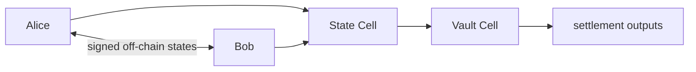
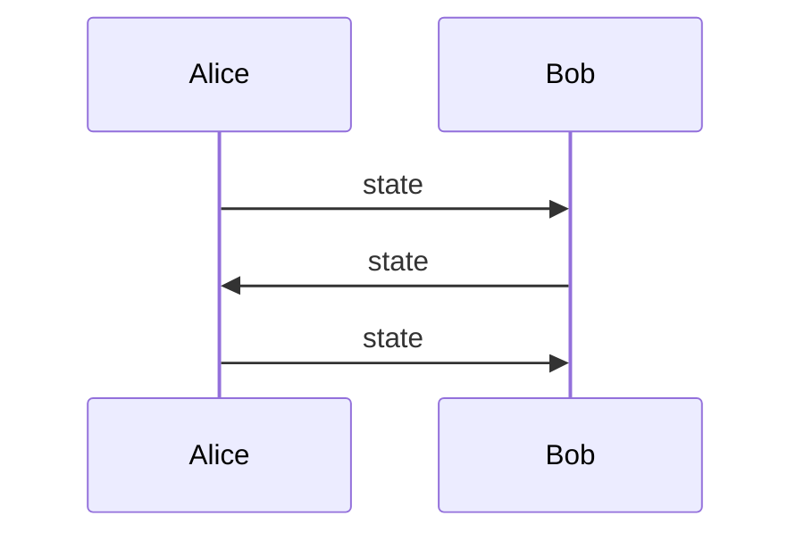
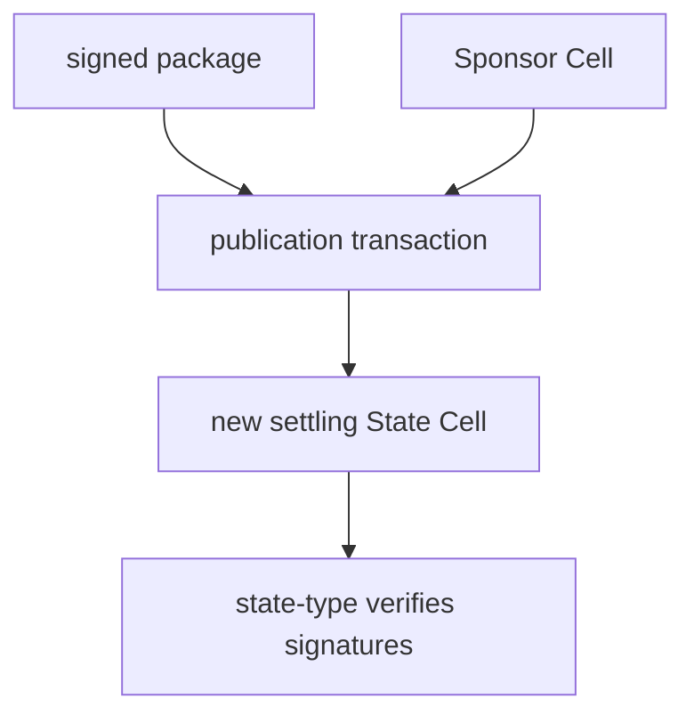
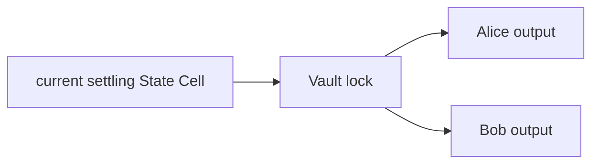
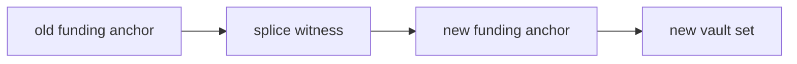
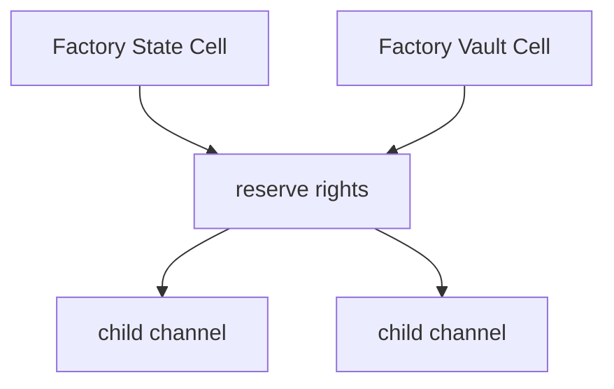
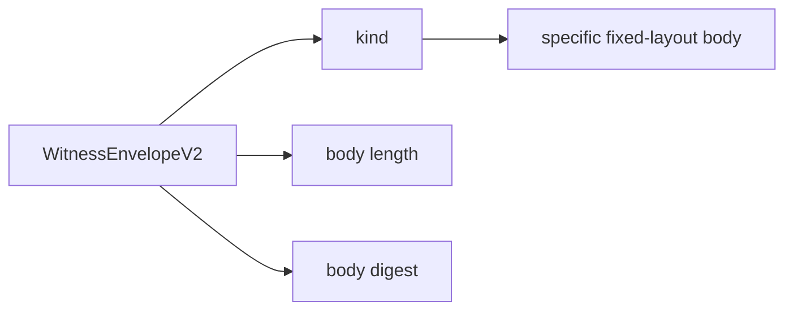

# Morph Channel Tutorial

This tutorial explains Morph Channel gently. It is for readers who want the
idea before reading scripts, proof bodies, and devnet reports.

## The Problem

On-chain transactions are reliable, but they are not the best place to record
every small payment or balance change. A channel lets two parties lock assets
once, update balances off chain, and use the chain only when they need a public
settlement.

Morph Channel asks: what does that look like when the base chain is CKB and the
native object is a Cell?

## The Basic Picture



There are two important Cells:

- the **State Cell** says which channel state is publicly enforceable;
- the **Vault Cell** holds the assets.

Alice and Bob can exchange many signed states without touching the chain. If
they need to settle, the latest signed state can be published and the vault can
later pay out according to that state.

## Step 1: Open

Alice and Bob create:

```text
State Cell  -> channel identity, state number, funding anchor, settlement hash
Vault Cell  -> locked CKB or xUDT assets
Sponsor Cell -> optional fee budget for publication
```

From a user's point of view, this is a deposit. The funds are no longer in an
ordinary wallet cell; they are held by channel rules.

## Step 2: Update Off Chain



Each newer state has a higher state number. The scripts reject stale or equal
state numbers, so the public path moves forward.

## Step 3: Publish

If Alice or Bob needs the chain to recognise the latest state, they publish a
signed package.



The sponsor can pay the fee, but sponsor capacity cannot change the channel's
settlement. This keeps fee payment separate from value ownership.

## Step 4: Finalise

After the relative `since` delay, the Vault Cell can be spent.



The vault lock checks that the settlement outputs match the descriptor
committed in the signed state. For xUDT, it also checks token type and exact
token amounts.

## Step 5: Splice

A splice resizes a channel without closing the relationship.



Splice-in adds assets. Splice-out withdraws assets. The channel keeps its
logical identity, but the funding anchor and vault set move forward with signed
transition evidence.

## Step 6: Factory Channels

A factory is a shared reserve that can create child channels.



The conservative path requires all factory participants to sign. Reduced paths
prove a narrow local change, such as one participant reducing their own reserve
claim. Factory scripts receive those proofs through `WitnessEnvelopeV2`.

## Why `WitnessEnvelopeV2` Matters

Earlier factory work used body names that still end in `V1`. In the current
design, the public contract-facing factory witness is an envelope:



That means the script first authenticates the envelope, then parses the body
chosen by the envelope kind.

## What To Run First

For local development:

```sh
make ci
make build-contracts
make contract-tests
```

For a local devnet smoke run:

```sh
scripts/devnet-node.sh
make devnet-smoke
```

For the full local stateful acceptance layer:

```sh
make devnet-stateful-e2e
```

## What To Read Next

- [Devnet guide](devnet.md): run the local node and report gates.
- [Implementation notes](implementation.md): protocol objects and scripts.
- [Roadmap](roadmap.md): what is done and what remains.
- [Mainnet readiness](mainnet-readiness.md): why this is not production yet.
