# Morph Channel, Explained Simply

[中文版本](morph-channel-tutorial.zh.md)

This is a plain English guide to Morph Channel for CKB community members who
know what a Cell is, but do not want to spend their afternoon wrestling a
protocol diagram. Start with the shape of the idea, then let the details land
one by one.

Morph Channel is a way for two or more people to keep changing an agreement
off chain, then bring only the useful result back to CKB when needed. It is not
a new chain. It is not a side chain. It is CKB Cells doing what CKB Cells are
good at: holding value, carrying rules, and refusing to be fooled.

Imagine Alice and Bob using an app that changes balance often. Putting every
small step on chain would be slow and expensive. Keeping everything off chain
would feel a little too trusting. Morph lets them update normally off chain,
then ask CKB to enforce the latest valid result when it matters.

If you take only three ideas from this guide, take these:

- Morph keeps the busy work off chain, but keeps the final enforcement on CKB.
- It separates agreement, locked value, and fee payment into different Cells.
- Its best use is not generic payment routing, but CKB-native state and asset
  control.

## The Short Version

For a first pass, think of a Morph channel as three simple objects:

- A StateCell is the latest signed agreement.
- A VaultCell is the locked box holding the money or tokens.
- A SponsorCell is the fuel card that pays chain fees without touching the
  locked money.

The channel works because CKB scripts check that these objects agree with each
other. An old agreement should not control a new vault. Fee money should not
quietly become user balance. Assets should not be swapped under the table. The
clearer the drawers, the less the user has to worry about the machinery.

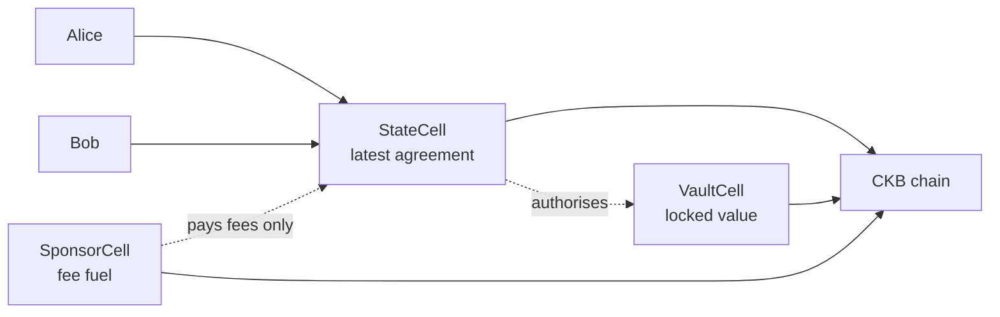

The important split is this:

- The StateCell says what the latest valid outcome is.
- The VaultCell holds the assets until that outcome is ready to settle.
- The SponsorCell pays for publication, but must not become part of the
  channel balance.

That split is the heart of Morph.

## Why Channels Exist

On chain transactions are public, durable, and strong. They are also slower
than two people signing messages between themselves.

A channel uses the chain as a judge, not as a clerk stamping every step. Most
updates happen off chain. The chain is used when the channel opens, when
someone needs to publish the latest state, or when the final result must be
paid out.

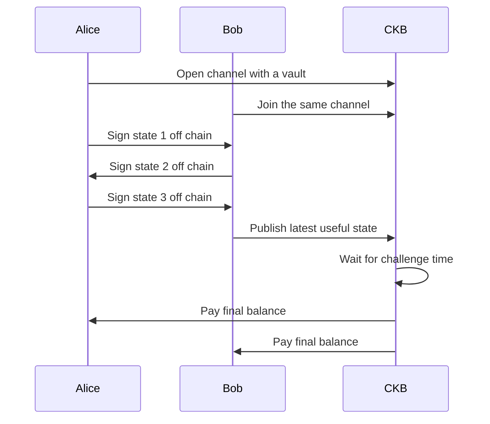

The important bit is not that people sign things. The important bit is that the
on chain scripts know which signed agreement is valid, which one is stale, and
which one is allowed to spend the vault.

## The Principle

Morph keeps a stable channel identity, but lets the signed state move forward.
The channel is like the account. The state is like the latest page in the
ledger.

In everyday language:

1. The channel has a name.
2. The locked value belongs to that named channel.
3. Participants sign newer and newer agreements.
4. CKB accepts only the correct kind of newer agreement.
5. The vault pays out only according to the accepted state.

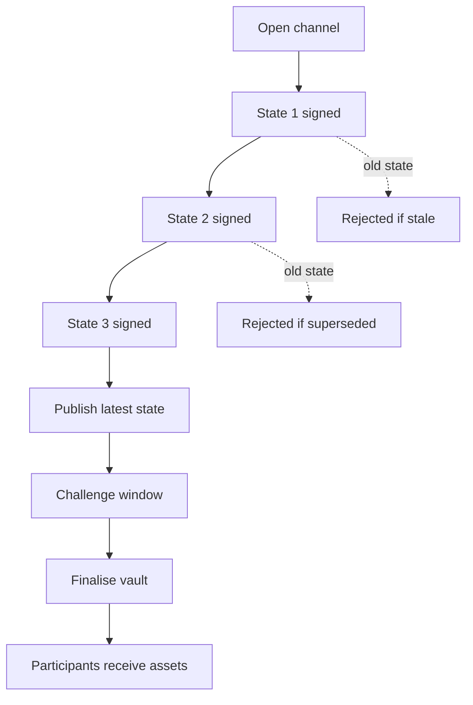

This gives the channel a useful property: the chain does not need to know every
small update, but it can still enforce the final one.

## A Tiny Balance Example

Suppose Alice and Bob lock 10 CKB into a channel. At first they agree that each
side owns 5 CKB. After a few app actions, they sign a newer state where Alice
has 7 CKB and Bob has 3 CKB.

| Moment | Alice | Bob | What CKB sees |
| --- | --- | --- | --- |
| Open | 5 CKB | 5 CKB | The vault is locked |
| Update off chain | 6 CKB | 4 CKB | Nothing new |
| Update off chain | 7 CKB | 3 CKB | Nothing new |
| Settle | 7 CKB | 3 CKB | The latest valid state |

CKB does not need to watch every small move. It only needs enough evidence to
enforce the final valid balance. That is the whole point of the channel, minus
the dramatic music.

## What Makes It CKB Native

Morph is CKB native because it is built around Cells, type scripts, lock
scripts, and asset rules rather than trying to copy another chain model.

Here is the simple mapping:

| CKB idea | Morph use |
| --- | --- |
| Cell | A concrete object with value and rules |
| StateCell | The live channel pointer |
| VaultCell | The place where channel value sits |
| Type script | The rule that checks valid state progress |
| Lock script | The rule that checks who may spend value |
| xUDT | Token value that can be settled inside the same channel design |
| Since | The waiting period before final settlement |

The result is not a channel bolted onto CKB from the outside. It is a channel
whose pieces look like ordinary CKB objects.

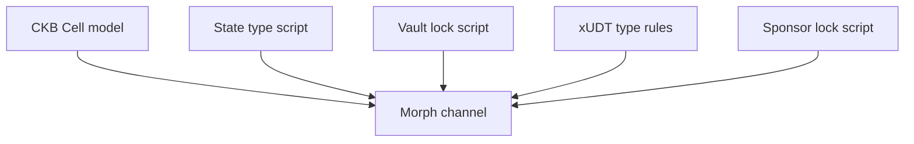

This matters because CKB is not only about moving one coin. It is about
programmable assets. Morph treats CKB capacity and xUDT tokens as first-class
channel assets, while keeping fee payment separate. That last part sounds
boring. It is also where many real systems trip over their shoelaces.

## Plain Terms

Here is the small vocabulary you need. Nothing here requires a whiteboard the
size of a cricket pitch.

| Term | Plain meaning |
| --- | --- |
| StateCell | The latest page of the channel agreement |
| VaultCell | The locked box that holds the assets |
| SponsorCell | The separate fee source for publishing state |
| Watchtower | A helper that can publish already-signed evidence |
| Factory | A shared reserve that can create child channels later |
| Splicing | Adding or removing vault value without closing the channel |
| Finalisation | The step where the vault pays the agreed outputs |

## The Main Advantages

Morph is designed for channels that need more than a quick payment. It cares
about how state changes, where value is held, how fees are paid, and how the
channel exits cleanly.

- It keeps the channel identity stable while states move forward.
- It separates user value from fee value.
- It can settle CKB and xUDT style assets with exact output rules.
- It gives watchtowers a reusable state package to publish.
- It can use factories, where a shared reserve later creates child channels.
- It follows CKB Cell rules instead of asking CKB to become something else.

The practical advantage is clarity. The current state, the locked assets, and
the fee source are different objects. When money is involved, clear drawers are
better than one heroic junk drawer.

## Common Misunderstandings

A few boundaries are worth making plain:

- Morph does not remove CKB settlement. It saves chain use for the moments
  where the chain is actually needed.
- A SponsorCell is not extra channel money. It can pay allowed publication
  fees, but it must not change user balances.
- A watchtower does not get to invent a result. It can only publish signed
  evidence that already exists.
- Splicing is not a free edit to the past. It changes vault value only when
  the participants agree which funding version the state belongs to.
- Morph is not mainly a routing network. It is mainly a CKB-native way to keep
  a known agreement moving off chain.

## Best Scenarios

Morph is a good fit when an application needs repeated updates between known
participants, but still wants a clean CKB exit.

Good examples:

- A trading pair that updates balances many times before settlement.
- A game or app session where the final result must be enforceable.
- A service relationship where many small changes should not all hit chain.
- A channel carrying both CKB and xUDT assets.
- A factory that keeps shared reserve value and opens child channels later.
- A wallet or app that wants sponsored publication without letting fee money
  mix with user balances.

Morph is probably not the best answer for a single one-off payment. If you are
buying one coffee, opening a channel may be a touch dramatic, even in Britain.

For broad payment routing, Fiber or Lightning-style networks are the more
direct mental model. Morph is more about CKB-native state and value control.

## How A Morph Payment Or Update Feels

From a user point of view, the normal path is not complicated:

1. Open the channel by locking value in a VaultCell.
2. Exchange signed updates off chain.
3. Keep only the newest useful state.
4. Publish the newest state if settlement is needed.
5. Wait the challenge period.
6. Finalise the vault and pay the outputs.

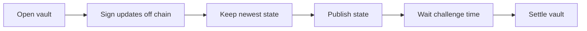

There is no need to show every small change to the chain. The chain only needs
to see the evidence at the moments that matter.

## If Someone Goes Offline

The channel is not broken just because one participant disappears. The other
participant can publish the latest signed state to CKB and start the waiting
period.

If someone tries to publish an older state, the challenge window gives the
newer signed state time to appear. A watchtower can help here, but it is not a
trusted judge. It only submits evidence the participants already signed.

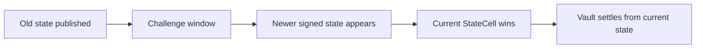

That is why channels need a little patience before final settlement. The wait
is not ceremony; it is the space where stale evidence can be corrected.

## Factories In Plain Words

A factory is a larger shared arrangement that can later create smaller child
channels.

Imagine several people put value into a shared warehouse. The warehouse has a
strict ledger. Later, a part of the warehouse can be turned into a smaller
channel without closing the whole warehouse.

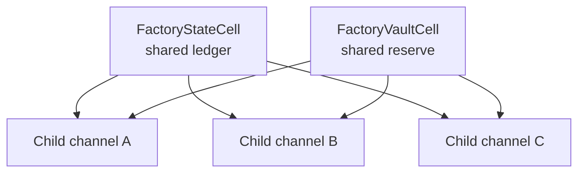

This is useful when many channels may be needed, but opening each one directly
on chain would be wasteful. The current implementation takes a conservative
route first. It is less glamorous, but easier to check properly.

## Splicing, The Important Next Step

Splicing means changing the amount of value inside a live channel without
closing it.

There are two directions:

- Splice-in adds value to the vault.
- Splice-out withdraws some value while the channel continues.

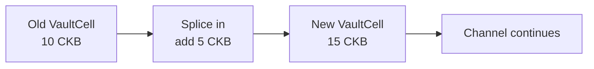

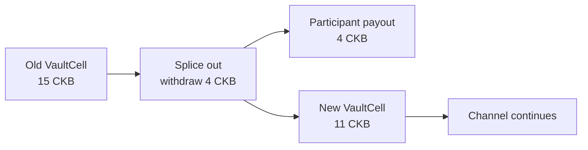

Why is this hard? Because the channel must not accidentally let an old state
settle against a new vault, or a new state settle against an old vault. Morph
therefore needs the state and vault to agree on the same funding version.

In plain words, after you change the locked box, everyone must agree which
notebook page belongs to that locked box. Otherwise someone will eventually
find the wrong page and call it clever.

## Morph Versus Fiber And Lightning

Lightning, Fiber, and Morph are all channel ideas, but they optimise for
different journeys.

Lightning is best known as a Bitcoin payment network. It focuses on fast
payments routed across a graph of channels.

Fiber is closer to the CKB world, but its public story is still payment network
first: route payments through connected channels, improve payment experience,
and use CKB strengths where helpful.

Morph is more cell-state first. It asks: how can CKB Cells hold state, vault
value, xUDT assets, fee sponsorship, factories, and settlement rules in a clean
native shape?

| Question | Lightning style | Fiber style | Morph style |
| --- | --- | --- | --- |
| Main job | Route payments | Route payments on CKB | Manage CKB-native channel state and value |
| Typical user action | Send across a payment path | Send across a CKB payment path | Update a channel or app state, then settle if needed |
| Main chain object | Funding output | Channel funding on CKB | StateCell plus VaultCell plus optional SponsorCell |
| Asset model | Mostly the base coin | CKB-oriented payment assets | CKB and xUDT style vault descriptors |
| Fee model | Usually part of transaction handling | Network and channel fee handling | SponsorCell can pay publication fees separately |
| Best fit | Public payment routing | CKB payment routing | Apps, assets, factories, exact settlement |

## Process Difference By Example

Here is a simplified Lightning or Fiber-style routed payment:

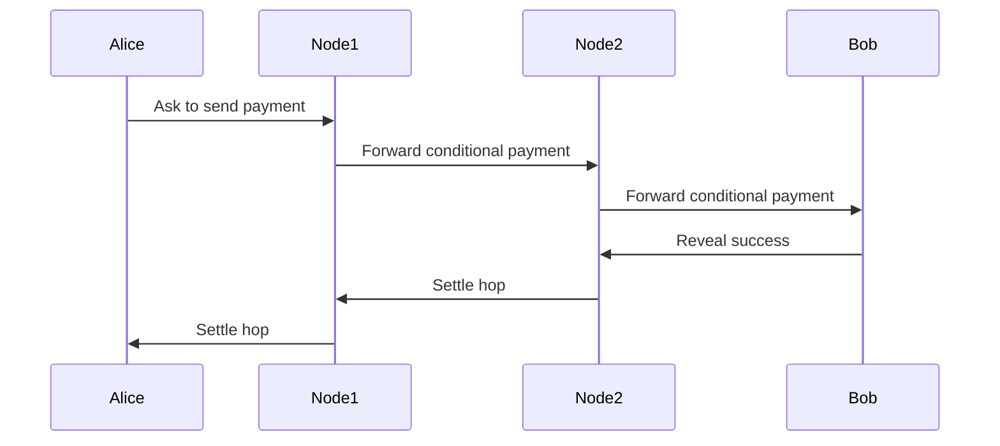

The focus is the path. Each hop must be able to forward and settle the payment.
This is excellent for paying someone you may not already share a channel with.

Here is a simplified Morph flow:

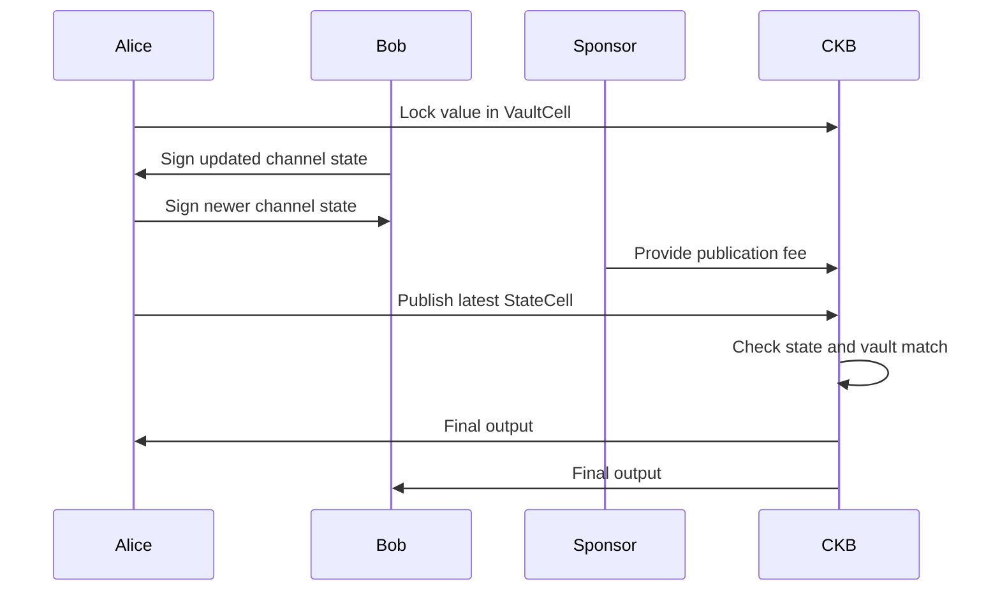

The focus is the state and the vault. Morph does not first ask which route the
payment should take. It first asks how the agreement can update safely, and how
the assets can be released correctly.

## A More Visual Comparison

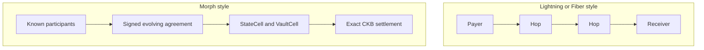

Both are useful. They are simply not the same tool.

## A Quick Fit Check

Use a normal CKB transaction when the action is one-off and does not need
repeated updates.

Use a payment network when the main question is how to pay someone through an
available route.

Use Morph when the main question is how to keep a CKB-native agreement moving
off chain, with exact on chain enforcement when required.

## What To Remember

Morph Channel is not trying to make CKB look like Bitcoin, Ethereum, or a
spreadsheet with a leather jacket. It is trying to use CKB as CKB.

The design idea is simple:

- Keep state in a StateCell.
- Keep value in a VaultCell.
- Keep fees in a SponsorCell.
- Let participants update off chain.
- Let CKB enforce the latest valid result.
- Let xUDT and factory patterns fit the same Cell-native story.

That is the quiet advantage. The channel is not magic. It is a careful
arrangement of ordinary CKB powers, which is often enough to be genuinely
useful.
