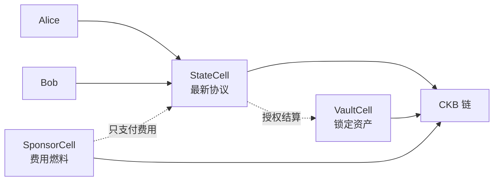
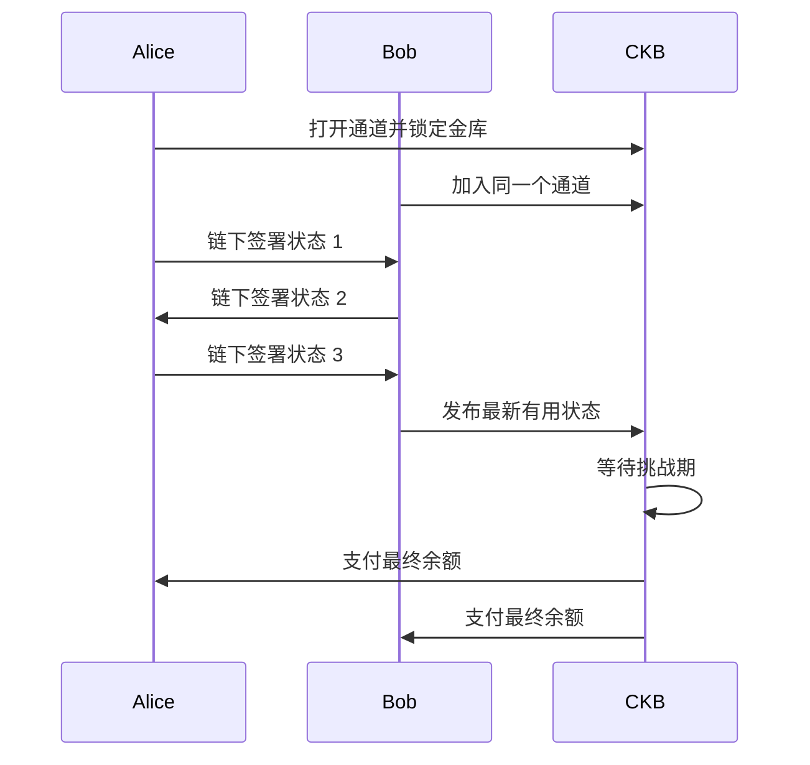
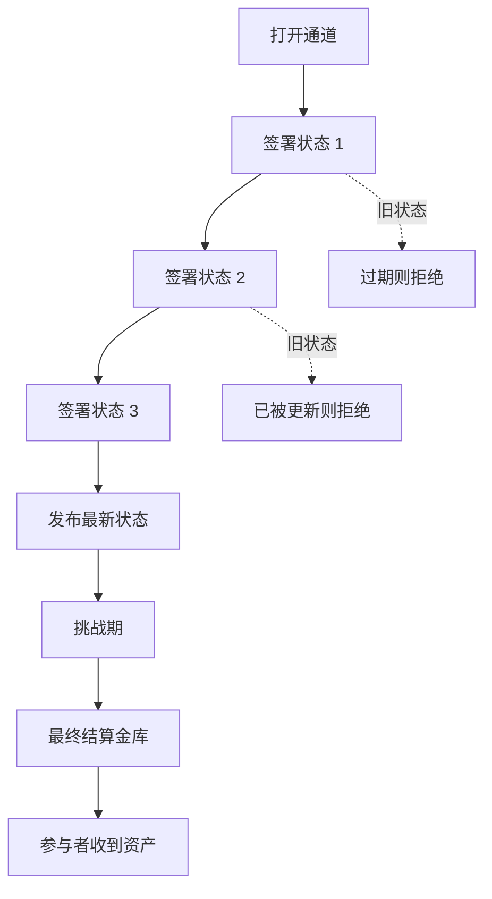
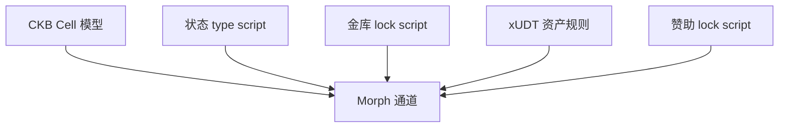
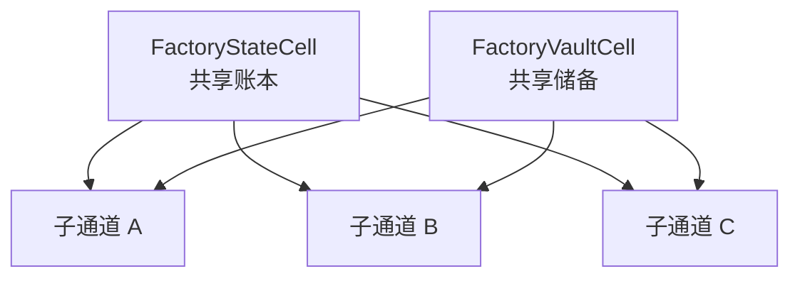
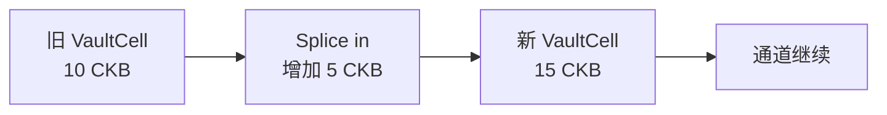
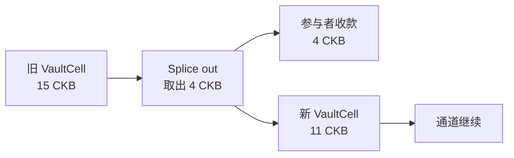
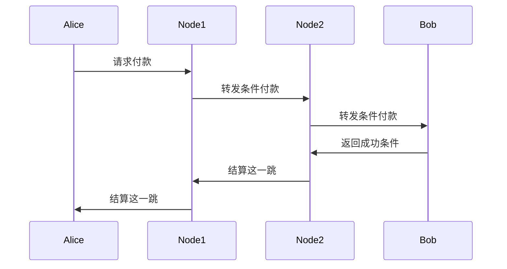
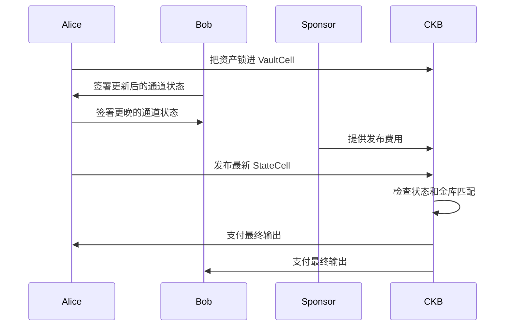

# Morph Channel 简明教程

[English version](morph-channel-tutorial.md)

这是一份写给 CKB 社区成员的中文说明。你只需要大致知道 Cell 是什么，
不需要先把所有协议名词背下来。先抓住直觉，再慢慢看细节，会轻松很多。

Morph Channel 是一种让两方或多方在链下不断更新协议，并在需要时把结果
带回 CKB 的方法。它不是新链，也不是侧链。它是用 CKB 原生的 Cell、
脚本和资产规则，来做一个可以被链上严格执行的通道。

可以想象 Alice 和 Bob 正在玩一个需要频繁结算的小应用。每一步都上链，太慢
也太贵；完全不上链，又缺少最后的保障。Morph 做的事，就是让他们平时在链下
更新，真要收尾或出现争议时，再把最新有效结果交给 CKB。

如果只带走三个想法，可以先记这三点：

- Morph 把频繁更新留在链下，但把最终执行权留给 CKB。
- 它把协议、锁定资产、费用支付拆成不同的 Cell。
- 它最适合的不是通用支付路由，而是 CKB 原生状态和资产控制。

## 一句话版本

先把 Morph 通道看成三个对象就够了：

- StateCell：记录最新签名协议。
- VaultCell：锁住真正的资金和资产。
- SponsorCell：负责支付上链费用，但不能碰通道里的钱。

通道能成立，是因为 CKB 脚本会检查这三个对象是否互相匹配。旧协议不能控制
新金库，费用资金不能混进用户余额，资产也不能被悄悄换掉。规则越清楚，用户
越不需要担心背后的复杂度。

关键拆分是：

- StateCell 说明当前有效结果是什么。
- VaultCell 保存通道里的资产，直到可以结算。
- SponsorCell 支付发布费用，但不进入通道余额。

这就是 Morph 的核心。

## 为什么需要通道

链上交易公开、持久、强约束，但它不会比两个人互相签消息更快。

通道的思路是让链当裁判，而不是让链替每一步盖章。大多数更新在链下完成。
只有打开通道、发布最新状态、最终结算时，才需要链上介入。

重点不是大家会签名。重点是链上脚本知道哪一份签名协议有效，哪一份已经过期，
以及哪一份可以控制 VaultCell。

## 基本原理

Morph 保持一个稳定的通道身份，同时允许签名状态不断向前推进。通道像一个
账号，状态像一页页更新的账本。

换成日常说法就是：

1. 通道有一个固定身份。
2. 锁定资产属于这个通道。
3. 参与者不断签署更新的协议。
4. CKB 只接受符合规则的新协议。
5. VaultCell 只按被接受的状态结算。

所以链不需要知道每一次小变化，但仍然可以执行最后那一次有效变化。

## 一个很小的余额例子

假设 Alice 和 Bob 把 10 CKB 锁进通道。最开始他们同意双方各有 5 CKB。
经过几次应用内操作后，他们签了一个更新状态：Alice 有 7 CKB，Bob 有 3 CKB。

| 时刻 | Alice | Bob | CKB 看到什么 |
| --- | --- | --- | --- |
| 打开通道 | 5 CKB | 5 CKB | 金库被锁定 |
| 链下更新 | 6 CKB | 4 CKB | 没有新上链动作 |
| 链下更新 | 7 CKB | 3 CKB | 没有新上链动作 |
| 结算 | 7 CKB | 3 CKB | 最新有效状态 |

CKB 不需要盯着每一次小变化。它只需要在最终执行时看到足够证据，然后按最新
有效余额结算。这就是通道的核心，去掉了背景音乐版本。

## 什么叫 CKB 原生

Morph 的原生性，不是说它跑在 CKB 上就算原生。更准确地说，它把 CKB 的
Cell、type script、lock script 和资产模型当作设计中心，而不是把别的链的
模型硬搬过来。

可以这样对应：

| CKB 概念 | Morph 中的作用 |
| --- | --- |
| Cell | 带有价值和规则的具体对象 |
| StateCell | 当前通道状态指针 |
| VaultCell | 通道资产所在的金库 |
| Type script | 检查状态是否能合法前进 |
| Lock script | 检查资产是否能被花费 |
| xUDT | 可以进入同一通道结算模型的代币资产 |
| Since | 最终结算前的等待时间 |

Morph 不是把通道外接到 CKB 上，而是让通道的每个部分都长得像普通 CKB
对象。

这点很重要。CKB 不只是转账一枚基础币，它更像一个可编程资产系统。Morph
把 CKB capacity 和 xUDT 都当作通道里的正式资产，同时把费用资金单独放开。
听起来朴素，但很多系统出问题，正是因为把不该混在一起的钱混在了一起。

## 白话术语表

下面这些词够用了，不需要先搬出一整块白板。

| 术语 | 白话意思 |
| --- | --- |
| StateCell | 通道协议的最新一页 |
| VaultCell | 保存资产的锁定金库 |
| SponsorCell | 单独用来支付发布费用的资金来源 |
| Watchtower | 可以发布已有签名证据的帮手 |
| Factory | 共享储备池，之后可以生成子通道 |
| Splicing | 不关闭通道也能增加或取出金库资产 |
| Finalisation | 金库按协议支付最终输出 |

## 主要优势

Morph 更适合那些不只是快速支付的通道场景。它关心的是状态怎样更新、资产
怎样锁住、费用怎样支付，以及最后怎样安全退出。

- 通道身份稳定，状态可以持续前进。
- 用户资产和手续费资金分开。
- 可以用明确规则结算 CKB 和 xUDT。
- Watchtower 可以复用状态包来发布最新状态。
- 可以通过 factory 使用共享储备池，再生成子通道。
- 遵循 CKB 的 Cell 规则，而不是要求 CKB 变成别的东西。

实际好处是清楚。当前状态、锁定资产、费用来源是不同对象。涉及钱时，分清
抽屉通常比一个英勇的大杂物箱更可靠。

## 常见误解

有几个边界值得先说清楚：

- Morph 不是取消 CKB 结算，而是把上链留给真正需要链的时候。
- SponsorCell 不是额外的通道余额。它可以支付被允许的发布费用，但不能改变
  用户余额。
- Watchtower 不能凭空改结果。它只能发布已经存在的签名证据。
- Splicing 不是随便改历史。它只有在参与者同意资金版本时，才能改变金库里的
  资产数量。
- Morph 主要不是路由网络。它更像是一种让已知参与者的 CKB 原生协议在链下
  持续前进的方法。

## 最适合的场景

当应用需要在已知参与者之间反复更新状态，同时又希望最终能干净地回到 CKB
结算时，Morph 很合适。

典型例子：

- 交易双方多次更新余额，最后再结算。
- 游戏或应用会话需要链上可执行的最终结果。
- 服务关系中有许多小额或频繁变化，不希望每次都上链。
- 一个通道同时承载 CKB 和 xUDT 资产。
- 多个参与者使用 factory 共享储备池，再按需打开子通道。
- 钱包或应用希望有人赞助手续费，但不想让手续费资金混入用户余额。

Morph 不一定适合一次性付款。如果只是买一杯咖啡，还专门开个通道，多少有点
像穿燕尾服去楼下取快递。

广义支付路由更像 Fiber 或 Lightning 的主场。Morph 更关注 CKB 原生状态、
资产和结算控制。

## 一次 Morph 更新是怎样发生的

从用户角度看，常规流程并不绕：

1. 打开通道，把资产锁进 VaultCell。
2. 双方在链下交换签名状态。
3. 只保留最新有用状态。
4. 需要结算时，把最新状态发布到链上。
5. 等待挑战期。
6. 结算 VaultCell，支付输出。

链不需要看到每一次小变化。它只需要在关键时刻看见证据，并按规则结算。

## 如果有人离线

一方离线，并不代表通道坏了。另一方可以把最新签名状态发布到 CKB，并开始
等待期。

如果有人试图发布更旧的状态，挑战期会给更新的签名状态留下出现时间。
Watchtower 可以在这里帮忙，但它不是可信裁判。它只能提交参与者已经签过的
证据。

所以通道在最终结算前需要一点等待。这不是仪式感，而是给旧证据被纠正的空间。

## 用白话讲 Factory

Factory 可以理解成一个更大的共享安排，它之后可以生成多个小的子通道。

想象几个人把资产放进一个共享仓库。仓库有严格账本。之后，仓库的一部分可以
变成一个小通道，而不用关闭整个仓库。

当很多通道可能被打开时，factory 可以减少每个通道都单独上链开通的成本。
当前实现先走保守路线。它不花哨，但更容易验证清楚。

## Splicing，下一步很重要

Splicing 指的是在不关闭通道的情况下，改变通道 VaultCell 里的资产数量。

方向有两个：

- Splice-in：向通道金库增加资产。
- Splice-out：从通道金库取出一部分资产，但通道继续存在。

它难在哪里？通道不能让旧状态拿去结算新金库，也不能让新状态拿去结算旧金库。
所以 Morph 需要让 StateCell 和 VaultCell 对同一个资金版本达成一致。

白话说，换了保险箱之后，大家必须知道哪一页账本对应这个保险箱。不然总有人
会翻出旧账本，然后假装自己发现了法律漏洞。

## Morph 和 Fiber、Lightning 的区别

Lightning、Fiber 和 Morph 都是通道思路，但优化方向不一样。

Lightning 最常见的定位是 Bitcoin 支付网络，重点是让付款通过通道网络快速
路由。

Fiber 更接近 CKB 生态，但它的公共叙事仍然更偏支付网络：通过连接起来的通道
完成支付路由，改善支付体验，并利用 CKB 的能力。

Morph 更偏 Cell 状态模型。它问的问题是：如何让 CKB Cells 原生地承载状态、
金库资产、xUDT、费用赞助、factory 和最终结算规则？

| 问题 | Lightning 风格 | Fiber 风格 | Morph 风格 |
| --- | --- | --- | --- |
| 主要目标 | 路由支付 | 在 CKB 上路由支付 | 管理 CKB 原生状态和资产 |
| 用户动作 | 通过支付路径付款 | 通过 CKB 支付路径付款 | 更新通道或应用状态，需要时结算 |
| 主要链上对象 | Funding output | CKB 上的通道资金 | StateCell 加 VaultCell，可选 SponsorCell |
| 资产模型 | 主要是基础币 | 面向 CKB 的支付资产 | CKB 和 xUDT 金库描述 |
| 费用模型 | 通常属于交易处理的一部分 | 网络和通道费用处理 | SponsorCell 可单独支付发布费用 |
| 最佳场景 | 公共支付路由 | CKB 支付路由 | 应用、资产、factory、精确结算 |

## 流程差异示例

一个简化的 Lightning 或 Fiber 风格路由支付，大致是这样：

重点是路径。每一跳都要能转发并结算付款。这很适合你没有直接通道、但想付给
网络中某个人的情况。

一个简化的 Morph 流程是这样：

重点是状态和金库。Morph 不是先问路怎么走，而是先问这份协议怎样安全更新、
资产怎样被正确释放。

## 再用一张图对比

两者都有价值，只是工具不同。

## 快速判断是否适合

如果只是一次性动作，用普通 CKB 交易更直接。

如果主要问题是怎样通过现有路径付给某个人，支付网络更合适。

如果主要问题是怎样让一个 CKB 原生协议在链下持续变化，并在必要时被链上精确
执行，Morph 更合适。

## 最后记住这些

Morph Channel 不是想把 CKB 变成 Bitcoin、Ethereum，或者穿着皮夹克的表格。
它是在认真使用 CKB 自己的能力。

设计想法其实很朴素：

- 用 StateCell 保存状态。
- 用 VaultCell 保存资产。
- 用 SponsorCell 保存费用来源。
- 参与者在链下更新。
- CKB 执行最新有效结果。
- xUDT 和 factory 也放进同一套 Cell 原生叙事里。

这就是它安静的优势。Morph 不靠神秘感取胜。它靠把普通的 CKB 能力摆在正确
位置上。很多时候，这已经足够有用。
