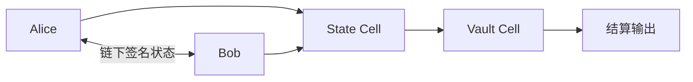
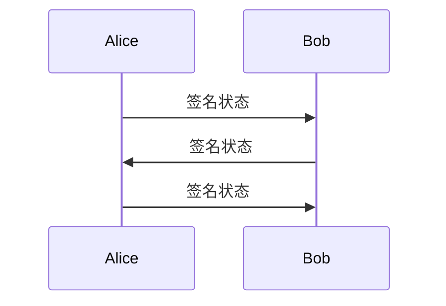
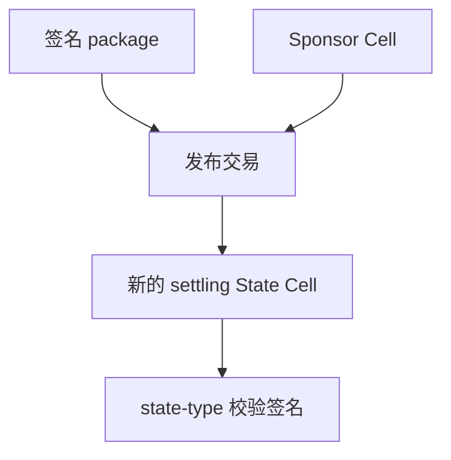
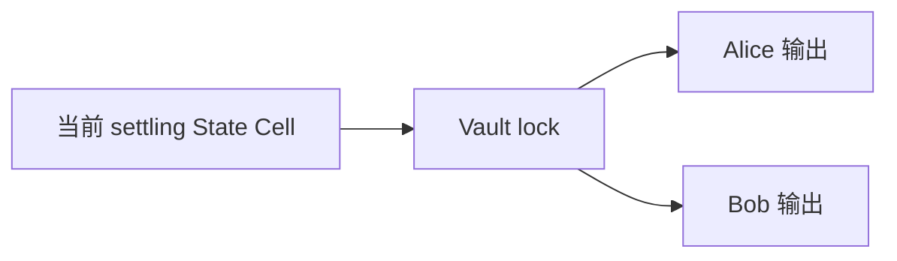
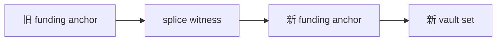
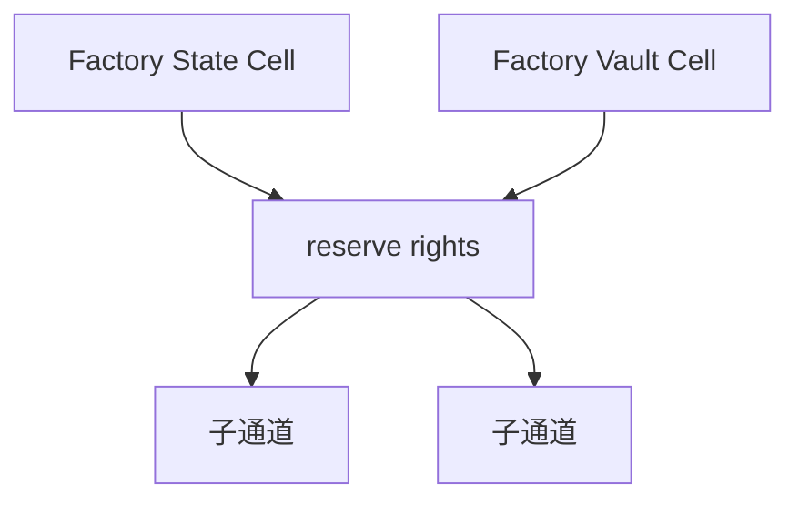
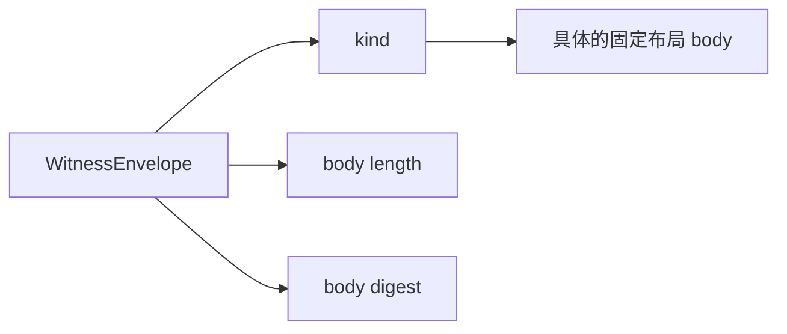

# Morph Channel 中文教程

这篇教程用比较轻的方式解释 Morph Channel。它适合先理解原理，再去读脚本、
证明体、devnet 报告和实现细节。

## 要解决什么问题

链上交易可靠，但不适合记录每一次很小的余额变化。通道的想法是：先把资产锁
进一个受规则控制的地方，之后双方在链下交换签名状态；只有需要公开结算、争议
处理、扩容/缩容或退出时，才把证据发布到链上。

Morph Channel 的问题是：如果底层链是 CKB，而 CKB 的原生对象是 Cell，那么
这个通道系统应该怎样表达？

## 基本图景



有两个核心 Cell：

- **State Cell**：公开记录当前可执行的通道状态；
- **Vault Cell**：真正持有 CKB 或 xUDT 资产。

Alice 和 Bob 可以在链下交换很多次签名状态，不必每次都上链。需要结算时，把
最新签名状态发布出来，然后 Vault Cell 按这个状态付款。

## 第一步：打开通道

打开通道时会创建：

```text
State Cell   -> 通道身份、状态号、funding anchor、结算描述符哈希
Vault Cell   -> 被通道规则控制的 CKB 或 xUDT 资产
Sponsor Cell -> 可选的发布手续费预算
```

从用户视角看，这一步就是充值或存入资产。资产不再由普通钱包 lock 直接控制，
而是由通道规则控制。

## 第二步：链下更新



每个更新状态都有更高的状态号。脚本会拒绝旧状态或相同状态号，所以公开路径只
能向前推进。

## 第三步：发布状态

如果 Alice 或 Bob 需要让链承认最新状态，就发布一个签名 package。



Sponsor 可以支付手续费，但 Sponsor 不能改变通道资产如何结算。手续费权限和
资产权限是分开的。

## 第四步：最终结算 Vault

经过相对 `since` 等待窗口后，Vault Cell 才能被花掉。



Vault lock 会检查结算输出是否匹配签名状态里承诺的 settlement descriptor。
如果是 xUDT，还会检查 token 类型和精确 token 数量。

## 第五步：Resize / Re-anchor（线上的名称是 `SPLICE`）

Resize 可以在不关闭逻辑通道关系的情况下更新资金上下文。当前 wire format、
package 和 CLI 仍保留历史名称 `SPLICE`。



Resize-in 是增加资产，resize-out 是取出资产。稳定的 `channel_id` 保持不变，
但签名的 funding anchor、Vault commitments 和 `funding_epoch` 会向前移动；
工具再根据这些上下文和精确 Vault OutPoint 派生新的 `funding_context_id`。旧
Vault 会被消费，后继 Vault 被新的 State Header 承诺。对于 resize-out，参与者
签名还会承诺精确的提现 lock，Vault 脚本要求链上存在该 lock 和精确 CKB/xUDT
数量的输出。

## 第六步：Factory 通道

Factory 是一组共享 reserve，可以从里面物化出子通道。



保守路径要求所有 factory 参与者签名。Reduced 路径只证明一个很窄的局部变化，
例如一个参与者减少自己的 reserve claim。Factory 脚本通过
`WitnessEnvelope` 接收这些证明。

只改变 Factory 内部权利、且 Factory Vault 不变时，相关参与者可以在协作状态
下把更新保留在链下。增加或移除 Factory 资金、物化子通道、强制退出则必须上链。
当前 bounded proof profile 不支持通用的 multi-right reduced rebalance。

## 为什么 `WitnessEnvelope` 重要

有些 body/schema 名字仍然带 `current` 后缀。当前设计里，factory 合约面对的公开
witness 是 `WitnessEnvelope`：



脚本先校验 envelope，再根据 kind 解析具体 body。这样可以让 body 保持简单的
固定布局，同时让公开授权边界更清晰。

## 先运行什么

本地检查：

```sh
make ci
make build-contracts
make contract-tests
```

本地 devnet smoke：

```sh
scripts/devnet-node.sh
make devnet-smoke
```

本地 stateful acceptance：

```sh
make devnet-stateful-e2e
```

## 下一步读什么

- [Devnet guide](devnet.md)：本地节点、smoke 路径和报告 gate。
- [Implementation notes](implementation.md)：协议对象和脚本边界。
- [Roadmap](roadmap.md)：已经完成什么，还剩什么。
- [Mainnet readiness](mainnet-readiness.md)：为什么现在还不能宣称生产可用。
