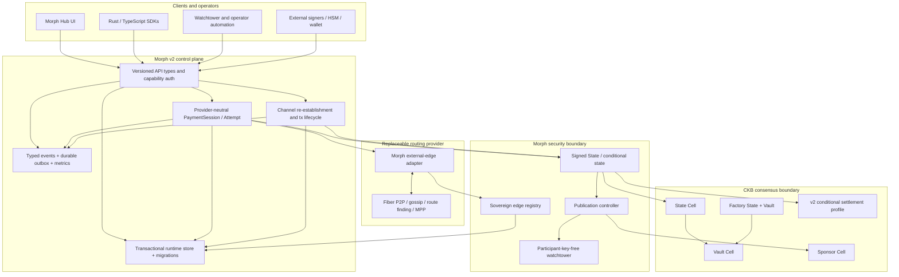
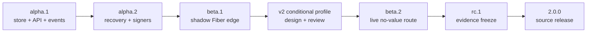
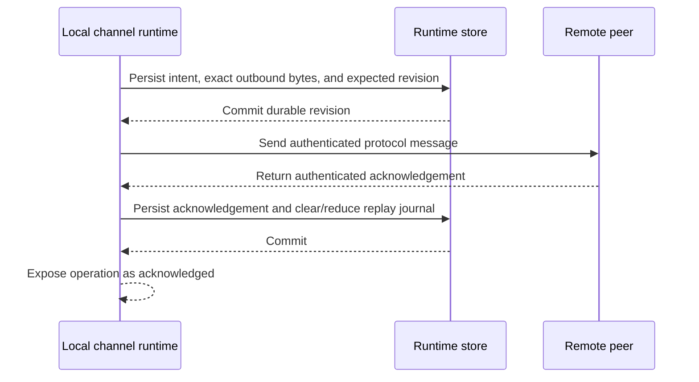
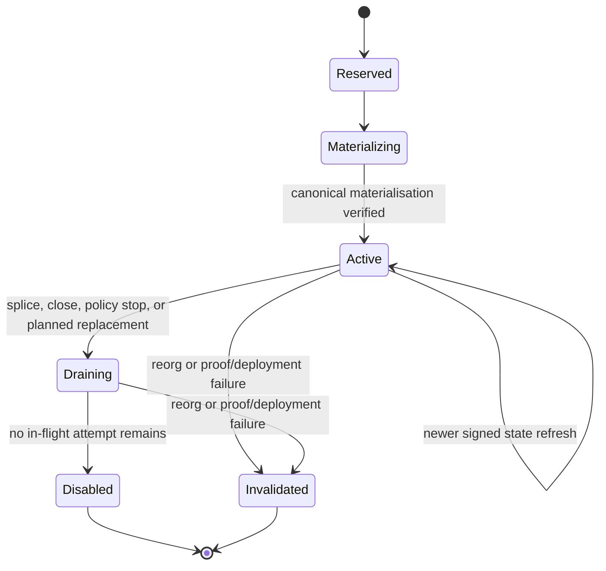
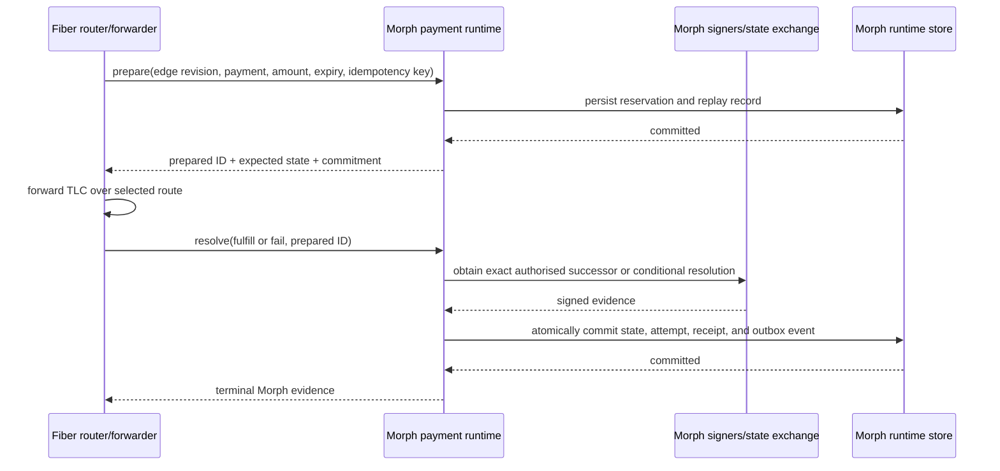

# Morph Channel v2.0 Roadmap

Status: proposed engineering roadmap. The current source release remains
`v1.11.0`. This document describes intended work; it is not evidence that the
work is implemented, reviewed, deployed, or safe for real assets.

Morph v2.0 is a node-engineering and integration release built on the existing
CKB-enforceable State/Vault/Sponsor model. Its purpose is to turn the current
controlled-devnet protocol implementation into a crash-recoverable,
observable, externally signable service that can expose a real Morph-backed
edge to Fiber without making Fiber the owner of Morph state or value.

Version `2.0.0` will not, by itself, mean mainnet readiness. The independent
review, public-network measurement, independent operator, reproducible build,
and real-asset policy gates in [Mainnet Readiness](mainnet-readiness.md) remain
separate and mandatory.

## Contents

- [Starting point](#starting-point)
- [v2.0 outcome](#v20-outcome)
- [Architecture](#architecture)
- [Engineering principles](#engineering-principles)
- [Release train](#release-train)
- [Workstreams](#workstreams)
- [Compatibility and migration policy](#compatibility-and-migration-policy)
- [Security invariants](#security-invariants)
- [Verification strategy](#verification-strategy)
- [Operational objectives](#operational-objectives)
- [Risks and decision gates](#risks-and-decision-gates)
- [Definition of done](#definition-of-done)
- [Post-v2 candidates](#post-v2-candidates)

## Starting Point

### What v1.11 already provides

The v2.0 plan assumes the following v1.11 boundaries remain available and
tested:

| Area | v1.11 baseline |
| --- | --- |
| Bilateral state | Fixed-layout participant-signed state, monotonic state numbers, exact funding context, publish, supersede, and finalise paths |
| Value boundary | Separate Vault Cell authority with authentic State Cell and exact settlement-output checks |
| Publication fees | Separate Sponsor Cell, node-informed fees, exact final-size convergence, bounded CKB RBF, and immutable participant evidence |
| Watchtower | Participant-key-free packages, canonical block-hash cursor, reorg reset/rescan, policy profiles, durable attempt logs, and JSONL/webhook alerts |
| Factory | Two to sixteen participants, N-of-N full paths, bounded reduced paths, explicit child materialisation, and Factory Vault isolation |
| Agent | x402-style challenge flow, Biscuit credentials, fair exchange, encrypted atomic local store, and a real Fiber-routed sidecar rehearsal |
| Fiber boundary | Provider-neutral edge model and a strict adapter contract; no false claim that current Fiber graph RPCs create a Morph-backed route |
| Evidence | Unit/property tests, CKB-VM contract tests, fixtures, devnet reports, hardening evidence, and deterministic contract packaging |

### What remains incomplete

The present implementation is intentionally a research prototype rather than a
long-running payment node:

- Hub, Agent, watchtower, publication, and edge state do not share one
  transactionally consistent runtime store or migration system.
- Watchtower chain reorg recovery exists, but Morph has no native peer
  re-establishment protocol for interrupted off-chain updates.
- Devnet commands accept local private-key material; there is no general
  participant/operator/sponsor signer interface for hardware or remote custody.
- Hub events, watchtower JSONL, webhooks, and health files are useful but not a
  unified typed event stream with a durable delivery outbox and Prometheus
  service objectives.
- Morph Agent consumes portions of Fiber JSON-RPC as untyped JSON and does not
  own a provider-neutral multi-attempt payment-session model.
- The Morph-to-Fiber adapter describes an external-edge hook, but the reviewed
  Fiber implementation does not provide that hook.
- A pending Fiber TLC is not yet independently force-enforceable by a Morph
  contract after Fiber disappears. A routed data-plane claim therefore remains
  blocked on a reviewed conditional-settlement profile.
- Runtime-state fuzzing, migration drift checks, crash-point testing, and
  bounded restart/reconnect tests are not yet first-class release gates.

## v2.0 Outcome

v2.0 is complete only when all of the following are true:

1. Security-critical runtime mutations are transactionally durable and have a
   tested forward-migration path.
2. A process or peer restart cannot lose an acknowledged signed state, replay a
   conflicting transition, resurrect an invalid edge, or duplicate a terminal
   payment result.
3. Participant, operator, and Sponsor signing can be delegated to external
   signers without allowing the signer or caller to mutate the authorised
   transaction or state skeleton.
4. Hub, watchtower, Agent, publication, and Fiber-edge activity use versioned
   API types, typed events, bounded metrics, and explicit readiness signals.
5. Fiber can mirror a Morph edge in shadow mode using optimistic provider
   revisions, and Morph remains the source of truth for edge lifecycle and
   liquidity evidence.
6. A routed conditional payment has a reviewed Morph force-close outcome for
   success and timeout/failure even if Fiber and the remote provider disappear.
7. A real no-value devnet route, including partial MPP failure and restart
   injection, crosses at least one Morph-backed Fiber edge and produces
   independently verifiable Morph settlement evidence.
8. Upgrade, rollback, fuzz, restart, adversarial, and reproducible-build gates
   pass from the exact release candidate.

The target can be summarized as:

> Fiber owns networking and route selection. Morph owns enforceable state,
> value, publication authority, and the evidence that an external edge is live.

## Architecture



The horizontal trust boundary is deliberate. Fiber may recommend a route and
mirror capacity, but it cannot create a Morph right, advance a Morph state,
change a settlement descriptor, consume Vault value, spend Sponsor capacity,
or declare a Morph payment terminal without Morph evidence.

## Engineering Principles

### 1. Preserve sovereignty

`morph-core` and CKB contracts must contain no Fiber-specific state or type.
Fiber integration stays behind a provider-neutral edge and payment interface.
Provider acknowledgements are reconciliation inputs, never settlement proof.

### 2. Persist before externally visible effects

Before Morph sends a state-changing peer message, broadcasts a transaction,
returns a terminal receipt, or acknowledges an edge revision, it must durably
record the exact intent and replay material needed to recover that effect.

### 3. Separate runtime migration from consensus migration

Hub views, payment sessions, event outboxes, and recovery journals may use
forward database migrations. Signed StateHeader bytes, witnesses, contract
arguments, and fixed-layout proof bodies must never be silently rewritten by a
runtime migration.

### 4. Make every replay idempotent

Every externally retried operation must carry a stable operation ID,
idempotency key, expected revision, or exact digest. Repeating an identical
operation returns the original result; repeating the identifier with different
content fails closed.

### 5. Keep secrets out of observers

Watchtowers, metrics exporters, event consumers, route providers, and
read-scoped API clients receive the minimum material required for their role.
In particular, participant state keys and settlement secrets are not forwarded
to a watchtower.

### 6. Evidence before claims

An implemented code path is not a completed milestone until its positive,
negative, restart, migration, and release evidence is reproducible from a
clean candidate. A version number never overrides an open readiness gate.

## Release Train

The milestone names describe dependency order, not calendar dates. A milestone
does not advance merely because a target date is reached.

| Milestone | Primary outcome | Contract change | Exit condition |
| --- | --- | --- | --- |
| `2.0-alpha.1` | Durable node foundation | No | Runtime store, forward migrations, typed events/outbox, API type split, and baseline metrics pass crash and schema tests |
| `2.0-alpha.2` | Recovery and external signing | No | Persist-before-send, deterministic re-establishment, generalized transaction lifecycle, and signer isolation pass restart/adversarial tests |
| `2.0-beta.1` | Fiber external edge in shadow mode | No | Fiber hook registers, refreshes, drains, disables, and reconciles Morph edges without carrying routed value |
| `2.0-beta.2` | Force-enforceable routed data plane | Yes: separately versioned v2 profile | Conditional settlement, Fiber-disappearance recovery, mixed-route payment, and partial MPP failure pass on no-value devnet |
| `2.0-rc.1` | Release evidence candidate | No additional wire change | Full CI, fuzz, migration, restart, fault-injection, reproducibility, runbook, and external review gates pass |
| `2.0.0` | Evidence-backed source release | Frozen from RC | Exact RC artifacts, hashes, schemas, operator profile, limitations, and sign-off are published without widening claims |



## Workstreams

### WS1 — Transactional Runtime Store and Migrations

#### Objective

Replace fragmented mutable JSON state with a runtime storage boundary that can
atomically persist related records and evolve without rewriting immutable
protocol evidence.

#### Proposed shape

Create a `morph-store` crate with:

- domain traits for channel recovery, payment sessions, edge registry,
  publication lifecycle, event outbox, and operator configuration metadata;
- SQLite as the first native backend unless benchmarks or deployment evidence
  demonstrate that it is unsuitable;
- an in-memory backend for deterministic unit/property tests;
- explicit transactions and compare-and-swap revisions;
- bounded prefix/range queries and pagination;
- a migration registry with ordered versions, plan output, backup hooks,
  progress reporting, and too-old/too-new failures;
- a schema-drift manifest checked in CI;
- a read-only validation command that scans every record family without
  starting network or mutation services;
- typed I/O and corruption errors rather than backend panics.

An illustrative runtime envelope is:

```text
record_family
schema_version
network_id
deployment_id
record_id
record_revision
payload_checksum
payload
```

This is a runtime persistence concept, not a new CKB wire format.

#### Data ownership

| Data | v2 storage rule |
| --- | --- |
| Hub peers/channels/factories/invoices | Versioned runtime records; imported from the v1 whole-file snapshot with preview and backup |
| Agent challenges/receipts/offers | Remain encrypted at rest; migrate through authenticated plaintext in memory, then re-encrypt |
| Payment sessions and attempts | Transactional records with stable IDs, terminal-state uniqueness, and pagination |
| Edge registry and provider revisions | Transactional, with one authoritative lifecycle per Morph edge |
| Channel replay journal | Stored atomically with the state revision that made replay necessary |
| Event outbox | Stored in the same transaction as the state mutation that emitted it |
| Signed packages and witnesses | Immutable content-addressed artifacts; database stores references and hashes only |
| Publication attempt evidence | Append-only evidence retained independently; indexed metadata may be stored but records are not rewritten |

#### Migration rules

For every supported migration `M`:

$$
validate_{new}(M(decode_{old}(record))) = true
$$

For immutable evidence references:

$$
hash_{before}(evidence) = hash_{after}(evidence)
$$

- A migration must be resumable or transactionally rolled back.
- Database versions newer than the binary fail closed.
- Destructive or lossy steps require an explicit export and operator
  confirmation; they cannot be hidden in normal startup.
- Downgrade means restoring the pre-migration backup with the prior binary, not
  running an invented reverse parser.
- Migration tests include v1 Hub import, encrypted Agent Store import, empty
  database creation, interrupted migration, disk-full behavior, and corrupted
  record families.

#### Exit criteria

- No acknowledged mutation is lost across a process kill after commit returns.
- Related channel state, replay journal, revision, and outbox event are never
  observed partially committed.
- Every supported prior runtime schema has a fixture and automated upgrade
  test.
- The store validator reports record family, identifier, and safe remediation
  without dumping secret payloads.

### WS2 — Channel Re-establishment and Deterministic Replay

#### Objective

Recover an interrupted Morph off-chain session from durable, mutually
authenticated facts rather than reconstructing messages from current memory.

#### Re-establishment record

The exact wire encoding is a design deliverable. Semantically, each side must
bind at least:

- `channel_id`;
- `funding_context_id` and `funding_epoch`;
- latest fully signed `state_number` and exact StateHeader digest;
- current phase;
- last sent and last acknowledged protocol sequence;
- pending operation ID, kind, content digest, and expected successor state;
- retained signature/message bytes required for deterministic replay;
- last canonical StateCell observation and block hash, when available.

No private key is part of this message.

#### Recovery decisions

| Situation | Required behavior |
| --- | --- |
| Same funding context, state number, and digest | Resume from the first mutually unacknowledged durable operation |
| Peer is one completed state behind | Replay the exact retained signed bytes; do not rebuild or re-sign from mutable inputs |
| Same state number but different digest | Emit a critical conflict, stop channel mutation, preserve evidence, and require incident handling |
| Funding context differs | Do not replay across contexts; drain/disable the old edge and reconcile splice/re-anchor state |
| Local pending operation lacks durable replay material | Fail closed and renegotiate or force the documented recovery path; never invent acknowledgement |
| Canonical chain is equal or newer | Reconcile against the chain before sending an obsolete off-chain transition |
| Cursor block hash is orphaned | Apply the existing watchtower reset-to-floor behavior before declaring recovery complete |

#### Required write ordering



#### Restart matrix

Tests must stop either participant before and after each arrow in the sequence
above, then restart one or both processes. The matrix covers:

- normal bilateral update;
- concurrent duplicate update request;
- splice/re-anchor preparation and activation;
- Factory child materialisation;
- pending payment prepare, fulfill, fail, and timeout;
- publication submitted but not yet canonical;
- peer reconnect during chain reorg recovery;
- restart while an edge is draining.

#### Exit criteria

- Recovery has zero acknowledged-state data loss (`RPO = 0`) for
  security-critical transitions.
- Ten bounded restart cycles with bidirectional payments leave no stuck
  operation, duplicate terminal receipt, or inconsistent balance.
- Replaying the same durable journal produces byte-identical protocol messages
  and the same terminal state.
- A conflict never falls back to “latest local state wins” without participant
  evidence.

### WS3 — External Signing and Key-Custody Boundaries

#### Objective

Allow private keys to remain outside the Morph process while ensuring that the
external signer authorizes exactly the reviewed state or transaction skeleton.

#### Roles

The API treats these as distinct authorities:

| Role | May authorize | Must not authorize |
| --- | --- | --- |
| Participant signer | StateHeader, Factory full/reduced authorisation explicitly assigned to that participant | Sponsor spending, operator policy changes, another participant's signature |
| Operator signer | Publication carrier and operational acknowledgements allowed by its profile | Participant state, Vault settlement rewrite |
| Sponsor signer | Sponsor funding and permitted SponsorCell spend | State progression or settlement descriptor |
| Release signer | Release manifest and artifact provenance | Runtime channel/value operations |

#### Signing request

Every request should expose a reviewable, purpose-bound envelope containing:

- signing domain and protocol version;
- role and requested operation;
- chain genesis and deployment identity;
- channel/factory/funding-context identity where relevant;
- state number or provider revision;
- immutable payload or transaction-skeleton digest;
- human-readable amount, asset, fee cap, and destination summary;
- request expiry and anti-replay nonce.

The caller verifies the returned public key, signature encoding, low-S rule,
domain, request ID, and exact digest before use. For transaction signing, all
non-signature fields are compared with the frozen skeleton after the signed
transaction is returned.

#### Implementations

- Local in-process signer remains available only for tests and explicitly
  labelled devnet workflows.
- A process-isolated JSON-RPC or Unix-domain-socket signer is the first external
  implementation.
- Hardware wallet, PKCS#11, or cloud HSM support can be added behind the same
  interface after threat-model and vendor review.
- Watchtower service configuration must have no participant-signer handle.

#### Exit criteria

- Production-profile startup rejects raw participant private keys in ordinary
  process environment and command arguments.
- Logs, metrics, errors, traces, and event payloads contain no token, private
  key, preimage, or raw secret-bearing request.
- A malicious signer response that changes any frozen transaction field is
  rejected before broadcast.
- Operator A, operator B, participant, and Sponsor identities are asserted
  distinct where the deployment profile requires separation.

### WS4 — Versioned API, Capability Authorization, Events, and Metrics

#### Objective

Turn the current local Hub and sidecar endpoints into a reviewable control plane
without making them publicly exposed by default.

#### API structure

- Create a pure `morph-api-types` crate containing request, response, event,
  pagination, and error DTOs without node/runtime dependencies.
- Organize RPC/API methods by `node`, `channel`, `factory`, `payment`, `edge`,
  `watchtower`, `publication`, and `admin` modules.
- Generate OpenRPC or OpenAPI documentation and TypeScript types from the
  source declarations.
- Fail CI if generated schemas or reference documentation are dirty.
- Assign stable machine-readable error codes; human messages are explanatory
  but not client control flow.
- Require an explicit compatibility review for field removal, semantic change,
  or relaxed validation.

#### Capability authorization

Morph Agent already uses Biscuit credentials for paid resources. v2 extends the
capability model to administrative APIs with facts such as:

```text
read("channel", channel_id)
write("payment", account_id)
operate("watchtower", operator_id)
publish(channel_id, maximum_fee)
sign(role, public_key)
expires_at(timestamp)
```

Requirements:

- method rules fail closed when a new method lacks an authorization rule;
- tokens can be attenuated by resource, action, channel/operator identity,
  amount/fee, and time;
- revocation identifiers and key rotation are supported;
- public listening requires authenticated TLS termination or an equivalently
  reviewed transport;
- unauthenticated mode is restricted to an explicit loopback development
  profile;
- tokens are never included in log messages, error bodies, URLs, or metrics.

#### Typed event model

All components publish a common envelope:

```text
event_id
event_schema_version
occurred_at
persisted_at
component
kind
severity
correlation_id
channel_id / factory_id / payment_id / operator_id (optional)
funding_context_id / provider_revision (optional)
redacted_details
```

Events are persisted in the same transaction as the state change. Delivery is
at least once; consumers deduplicate by `event_id`. Webhook delivery records
attempt count, next retry, last error class, and acknowledgement. Dead-letter
handling requires an operator-visible critical alert.

#### Metrics and health

Expose low-cardinality Prometheus metrics for:

- channel/edge counts by lifecycle;
- payment sessions and attempts by terminal class;
- publication attempts, replacements, rejection classes, and canonical depth;
- watch cursor lag, reorg resets, and package age;
- Sponsor remaining budget and cap failures without identifying private cells;
- migration progress and corruption failures;
- event outbox backlog, retry age, and delivery failures;
- RPC latency, bounded concurrency, rate-limit rejection, and task restarts.

Liveness answers “is the process making progress?” Readiness separately answers
“is this instance safe to accept mutations?” An instance is not ready when its
store is inconsistent, migration is incomplete, signer policy is unavailable,
canonical RPC identity is wrong, or a required outbox is irrecoverably blocked.

#### Exit criteria

- Every mutating API method has a documented capability rule, idempotency
  behavior, audit event, and stable error family.
- Generated API documentation and TypeScript types are reproducible.
- Alert delivery survives process restart without loss or duplicate effects at
  an idempotent receiver.
- Metrics pass a cardinality review and contain no channel secrets or bearer
  material.

### WS5 — Provider-neutral Payment Sessions and the Fiber External Edge

#### Objective

Use Fiber for P2P, gossip, route selection, MPP, and route feedback while Morph
retains authoritative edge lifecycle, capacity evidence, and settlement.

#### Payment session model

Morph owns a provider-neutral session above `ChannelBackend`:

```text
PaymentSession
  request: amount, asset, destination, expiry, maximum_fee, maximum_parts
  status: Created | Inflight | Success | Failed | Cancelled | Expired
  attempts[]

PaymentAttempt
  attempt_id
  provider_id
  route_commitment
  edge snapshots: edge_id + provider_revision + funding_context_id
  amount + fee + expiry
  status: Created | Prepared | Inflight | Retrying | Success | Failed
  authenticated failure attribution
  timestamps and redacted error class
```

For a successful session:

$$
\sum amount(successful\ attempts) = requested\ amount
$$

and:

$$
\sum fee(successful\ attempts) \le maximum\ fee
$$

The number of concurrent parts and total retries are explicitly bounded.
`dry_run` performs route and policy evaluation without reserving Morph state or
sending a Fiber TLC.

#### External-edge control plane

The existing adapter contract remains intentionally narrow:

- `morph_register_external_edge`;
- `morph_update_external_edge`;
- `morph_disable_external_edge`;
- `morph_list_external_edges`.

Every mutation uses an expected provider revision. Registration binds the
Morph edge ID, channel/funding context, participant/Fiber node identities,
asset, directional liquidity, trusted deployment, canonical evidence block,
opaque Morph commitment, and callback endpoint.



Rules:

- Same-context state refresh preserves stable edge identity and increments the
  provider revision.
- Splice/re-anchor creates a new funding-context edge; the prior edge drains
  before disablement.
- Route construction snapshots edge revision. Forwarding rechecks that snapshot
  before prepare and again before commit.
- Unknown Fiber mirrors are disabled during reconciliation; they are never
  imported as Morph truth.
- Reorg, stale evidence, exhausted Sponsor policy, or unavailable enforcement
  can immediately prevent new prepares even while existing attempts drain.

#### Shadow mode (`2.0-beta.1`)

Fiber may include Morph edges in a non-forwarding diagnostic graph and exercise
registration, refresh, selection, prepare rejection, drain, disable, and
restart reconciliation. It must not carry user or test value through the edge.

Shadow evidence must prove:

- Fiber and Morph converge on edge ID, revision, enabled state, and commitment;
- stale-revision updates fail;
- duplicate identical requests are idempotent;
- a splice never updates the old edge in place;
- restart disables a mirror unsupported by canonical Morph evidence;
- route diagnostics explain why an edge is unavailable without leaking state
  package contents.

#### Live data plane (`2.0-beta.2`)

A payment through a Morph edge follows a durable prepare/resolve protocol:



Fiber success alone is insufficient. Morph returns terminal success only after
the corresponding enforceable state or conditional-settlement evidence is
durable and valid.

#### Route feedback

Morph may consume Fiber's authenticated failure attribution and time-decayed
route history, but it must distinguish:

- provider transport/routing failure;
- stale or disabled Morph edge;
- insufficient directional liquidity;
- signer/policy refusal;
- state conflict;
- chain/publication failure.

Only the responsible edge or hop is penalized. An unverifiable or hidden-route
failure must not corrupt visible Morph liquidity state.

#### Exit criteria

- One three-node route crosses a live Morph-backed edge on no-value devnet.
- MPP succeeds when enough parts settle and fails atomically when the configured
  aggregate cannot be fulfilled.
- Partial MPP failure, duplicate callback, provider restart, Morph restart,
  edge drain, and stale revision do not overpay, double settle, or strand a
  reservation.
- Provider replacement can reconstruct mirrors solely from canonical Morph
  records and immutable evidence references.

### WS6 — Conditional Force-close Profile

#### Objective

Make every pending routed outcome enforceable on CKB after the routing provider
or counterparty disappears. This is the only planned v2 workstream that changes
the contract/wire profile.

#### Boundary

The preferred design is one bounded conditional-settlement object per closing
channel, not a replacement for Factory state or Vault authority. The profile
must commit:

- ordered conditional-transfer root;
- payment hash and hash algorithm;
- exact asset and amount;
- direction and participant settlement identities;
- absolute expiry/timeout rule;
- success preimage or mature refund branch;
- bounded leaf count and proof shape;
- aggregate payout descriptor and required CKB carrier reserve;
- exact State/Vault/funding context to which the condition belongs.

#### Required properties

- A valid preimage can settle the success branch exactly once.
- Without the preimage, the timeout branch refunds the correct participant only
  after the canonical expiry condition.
- Success and refund cannot both consume the same condition.
- Aggregate settlement conserves CKB and every registered xUDT independently.
- A conditional object cannot mutate Factory membership, rights, reserve, or
  unrelated child channels.
- Unknown algorithms, counts, versions, proof shapes, duplicate leaves,
  noncanonical order, and mismatched assets fail closed.
- The host encoder and CKB parser have differential and hash-parity tests.
- Contract cycle, witness-size, and transaction-size limits are measured at
  one, typical, and configured maximum pending transfers.

#### Design and review gate

Before implementation:

1. write the threat model and state-transition table;
2. choose the bounded maximum from measured CKB limits rather than convenience;
3. freeze a single host/script encoding and domain set;
4. obtain focused external review of value conservation, timeout semantics,
   replay, and Factory non-interference;
5. assign a new deployment/profile identity and invalidate incompatible
   no-value development state.

The current `schemas/morph.mol` file remains documentation unless this review
explicitly adopts generated Molecule types as the one live v2 encoding. There
must not be two competing encoders.

#### Adversarial matrix

- wrong preimage, hash algorithm, asset, amount, participant, direction, or
  expiry;
- premature refund and post-expiry success race;
- duplicated, reordered, missing, or oversized leaves;
- fake State Cell, cloned Vault data at a different OutPoint, or wrong funding
  context;
- mixed CKB/xUDT carrier underfunding;
- reorg across success/refund observation;
- provider disappears after prepare, after forward, after preimage, and after
  only one participant has signed the next state;
- partial MPP with a mix of success, failure, and timeout branches.

#### Exit criteria

- All pending outcomes remain CKB-enforceable with Fiber stopped.
- CKB-VM tests cover every positive branch and named negative boundary.
- A clean external review finds no unresolved critical/high issue in the new
  contract surface.
- Reviewed ELF hashes, deployment identity, fixture manifest, and migration
  instructions are frozen before `2.0-beta.2` routes through the edge.

### WS7 — Generalized CKB Transaction Lifecycle

#### Objective

Apply the strongest v1.11 publication lessons to every long-running CKB
operation rather than maintaining one-off polling loops.

#### Lifecycle

```text
Built -> AwaitingSignature -> Submitted -> Pending -> Proposed
      -> Committed(depth) -> Finalised
      -> Replaced
      -> Rejected
      -> Unknown -> canonical reconciliation
      -> Reorged -> replay/rescan according to operation policy
```

The service tracks funding, activation, splice, publication, cooperative or
force close, conditional resolution, and finalisation. Each operation binds:

- logical operation ID and idempotency key;
- immutable intent/evidence digest;
- transaction hash and replacement lineage;
- exact input authority and expected outputs;
- fee profile and Sponsor attribution, when applicable;
- submission RPC identity and timestamps;
- canonical block/hash/depth observations;
- terminal evidence or typed failure.

#### Rules

- `Pending` or `Proposed` is not terminal success.
- `Unknown` and `Rejected` require operation-specific canonical reconciliation
  before the caller advances durable state.
- Restart checks current transaction status before rebroadcast.
- Replacement preserves the immutable participant evidence digest and follows
  node-reported fee/RBF rules.
- Multiple subscribers may await different status/depth conditions for one
  transaction without duplicating broadcast state.
- A component failure is isolated and supervised; one channel failure must not
  panic the entire watchtower or node.

#### Exit criteria

- Funding, publication, splice, close, and conditional-resolution flows use the
  common lifecycle or document why their semantics are incompatible.
- Restart from every nonterminal status reaches the same result as uninterrupted
  execution or a typed operator-action state.
- Reorg tests prove terminal state is not exposed before configured canonical
  depth.

### WS8 — Verification, Fuzzing, and Release Evidence

#### Objective

Turn recovery, persistence, API, and integration claims into continuously
reproducible evidence.

#### Required test layers

| Layer | Required coverage |
| --- | --- |
| Unit/property | State transitions, revisions, idempotency, migration transforms, payment aggregation, capability rules |
| Parser fuzzing | State/witness/package encoders, API DTOs, Fiber callback messages, event/store deserialization, conditional proofs |
| Model/state-machine | PaymentSession, edge lifecycle, channel re-establishment, transaction lifecycle, outbox delivery |
| Crash injection | Kill before/after every durable boundary, fsync/rename failure, disk full, corrupt/truncated records |
| Integration | Two Morph peers, watchtower, external signer, CKB node, Fiber route provider, provider restart/replacement |
| Contract | Host/script parity, CKB-VM positive/negative matrix, cycle and transaction-size budgets |
| Release | Clean build, locked dependencies, SBOM, deterministic package, artifact hashes, schema/doc drift checks |

#### CI tiers

- **Per change:** formatting, lint, source hygiene, unit/property tests, schema
  drift, short parser fuzz smoke, store migrations, SDK/UI build, and contract
  tests.
- **Nightly:** longer fuzz campaigns, restart/reconnect matrix, multiple storage
  backends where supported, race detection/model checks, and repeated devnet
  stateful flows.
- **Release candidate:** clean-room artifact reproduction, all fault families,
  long-running restart/MPP tests, independent operator rehearsal, dependency
  review, and external findings closure.

Long-running tests may remain excluded from the per-change path only when a
bounded regression version is present in required CI and the full variant is a
visible nightly/release gate.

#### Evidence manifest

Every RC evidence bundle records:

- Morph commit and dirty-state assertion;
- Fiber commit/patch identity;
- Rust toolchain, CKB version, lockfile and dependency hashes;
- contract source and ELF hashes;
- runtime schema, migration set, API schema, and event schema versions;
- signer/provider/operator public identities without secrets;
- exact commands, configurations, fault labels, timestamps, logs, reports, and
  artifact checksums;
- pass/fail/skip status for every required gate;
- external reviewer or independent reproducer attestation where required.

## Compatibility and Migration Policy

### Runtime data

- v2 supports an explicit, tested import from the final v1 Hub and Agent runtime
  formats selected for the release.
- Watch cursors are imported only if their canonical block hashes and channel
  floors validate against the configured chain; otherwise they reset and rescan.
- Edge mirrors are never trusted during import. They are rebuilt from canonical
  Morph registry and chain evidence.
- Terminal receipts and immutable attempt evidence retain their original bytes
  and hashes.

### Contract and wire data

- v1.11 State/Vault/Sponsor/Factory profiles remain identified by their exact
  deployed hashes and fixed layouts.
- The v2 conditional profile is a new deployment/profile. It is not an in-place
  script upgrade and must not be labelled compatible with v1 cells unless an
  explicit reviewed transition proves that claim.
- Domain strings, fixed lengths, witness versions, and proof shapes change only
  through a protocol-profile decision with host/script parity updates.
- No permissive legacy alias or “try both parsers” behavior is added merely to
  make an upgrade appear seamless.

### API compatibility

- Additive optional fields are allowed only with safe defaults and generated
  schema updates.
- Required-field removal, meaning changes, numeric-unit changes, or validation
  relaxation require an API version change.
- API version negotiation never relaxes the underlying contract or signer
  policy.

## Security Invariants

The following are non-negotiable across every v2 milestone:

1. Newer valid participant state wins; an operator/provider cannot manufacture
   a state transition.
2. Vault value cannot pay publication fees, and Sponsor authority cannot settle
   participant value.
3. Signed evidence is byte-stable across fee selection and replacement.
4. Exact funding context and Vault OutPoint provenance remain authoritative.
5. A Factory fee payer is not Factory authority.
6. Watchtower operation requires no participant private key or settlement
   secret.
7. Fiber is a replaceable routing provider, not the source of Morph state,
   liquidity, terminal settlement, or edge validity.
8. Same identifier plus different content is always a conflict, never an
   idempotent retry.
9. `Unknown`, `Rejected`, shallow commitment, reorg, stale revision, and missing
   replay evidence are explicit states; none are silently promoted to success.
10. Runtime migration cannot alter signed evidence, contract bytes, code hashes,
    or release provenance.
11. Failure of one channel, webhook, signer, or provider is supervised and
    isolated unless continued operation would violate a shared safety boundary.
12. Secrets are redacted by construction rather than by relying on callers to
    avoid logging them.

### Fiber patterns to adopt carefully

| Fiber pattern worth learning | Morph adaptation |
| --- | --- |
| Atomic state plus replay-diff persistence | Typed transactions and errors; no panic-on-I/O semantics |
| Commitment-number reconciliation and exact replay | Morph funding-context/state-digest reconciliation, preserving participant evidence |
| PaymentSession/Attempt, MPP, fee caps, dry-run, and route history | Provider-neutral orchestration above `ChannelBackend`; Fiber remains replaceable |
| Typed network/store events and subscriptions | Durable outbox for security alerts, not only best-effort subscriptions |
| Prometheus and profiling | Low-cardinality, redacted metrics with separate liveness/readiness |
| Pure JSON API types and generated RPC docs | `morph-api-types`, generated schemas/SDKs, and drift gates |
| Method-level Biscuit authorization | Resource-, channel-, operator-, amount-, and time-bounded capabilities with no token logging |
| Frozen external-funding transaction before wallet signing | Purpose-bound signer requests and exact post-signature skeleton comparison |
| Restart/reconnect and parser fuzz tests | A bounded subset in required CI plus longer nightly/RC campaigns |

### Fiber patterns not to copy

- Do not forward a local settlement private key to a remote watchtower.
- Do not let storage I/O or one child-task failure panic the entire node by
  default.
- Do not allow an unknown local RPC method merely because authentication is
  disabled.
- Do not treat a message type in a schema as proof that its runtime protocol is
  implemented or safe.
- Do not import Fiber channel identifiers, funding transactions, or provider
  acknowledgements as Morph authority.
- Do not make ignored long-running tests the only regression evidence for a
  security-critical recovery property.

## Verification Strategy

### Milestone acceptance matrix

| Property | alpha.1 | alpha.2 | beta.1 | beta.2 | RC |
| --- | ---: | ---: | ---: | ---: | ---: |
| Store transactions and migrations | Required | Required | Required | Required | Required |
| Typed API/events/auth/metrics | Required | Required | Required | Required | Required |
| Deterministic peer recovery | — | Required | Required | Required | Required |
| External signer isolation | — | Required | Required | Required | Required |
| Fiber edge registration/reconciliation | — | — | Shadow | Live | Required |
| Conditional force-close | — | Design frozen | No routed value | Required | Required |
| Mixed Fiber/Morph MPP route | — | — | Diagnostic only | No-value devnet | Repeated evidence |
| Parser/store fuzzing | Smoke | Smoke | Nightly | Nightly | Extended |
| Independent contract review | — | Design review | In progress | Required for new profile | Findings closed |
| Public-network/mainnet gates | Open | Open | Open | Open | Still separately gated |

### Required negative scenarios

At minimum, v2 release tests reject or safely recover from:

- stale state, funding context, edge revision, signer request, or route snapshot;
- same state number with conflicting digest;
- duplicate callback with different resolution;
- missing replay journal after an unacknowledged external effect;
- corrupted, truncated, too-new, or partially migrated runtime state;
- wrong chain genesis, deployment code hash, asset Type Script, proof program,
  operator identity, or signer public key;
- webhook replay, token replay, expired/attenuated capability, and method without
  an authorization rule;
- Fiber mirror resurrection after close, splice, reorg, or proof invalidation;
- provider disappearance at every payment boundary;
- partial MPP success that does not equal the requested amount;
- fee aggregation over the caller or deployment cap;
- transaction `Unknown`/`Rejected` and shallow-commit reorg;
- watcher started with participant key access or shared operator identities when
  separation is required.

## Operational Objectives

Numerical thresholds must be selected from measured profiles before RC rather
than invented in this roadmap. The release profile must nevertheless define and
enforce objectives for:

| Objective | Measurement |
| --- | --- |
| Recovery point | Zero loss of acknowledged signed states, terminal receipts, edge revisions, and publication intents |
| Recovery time | Time from process/peer availability to safe mutation readiness, reported by channel count and worst case |
| Watch protection | Canonical cursor lag, package age, remaining challenge budget, and successful independent operator coverage |
| Payment reliability | Session success/failure, attempt count, partial MPP recovery, fee paid, and terminal latency percentiles |
| Edge freshness | Time since canonical evidence, provider revision lag, draining age, and invalidation-to-disable latency |
| Alert delivery | Durable outbox age, retry count, acknowledgement delay, and dead-letter count |
| Migration safety | Records scanned/migrated/failed, backup identity, duration, and post-migration validator result |
| Transaction finality | Submission-to-canonical-depth latency, replacement count, rejection class, and reorg recovery time |

For a channel with configured challenge window `W`, already spent canonical
confirmations `C_spent`, reserved recovery/publication blocks `R`, and required
terminal confirmation depth `C_terminal`, normal mutation readiness requires:

$$
W - C_{spent} - R > C_{terminal}
$$

If the inequality fails, the runtime enters a typed emergency state and follows
the publication/runbook path instead of continuing optimistic routing.

## Risks and Decision Gates

| Risk | Consequence | Mitigation / decision gate |
| --- | --- | --- |
| Runtime store becomes a second source of consensus truth | Database corruption could override signed/on-chain evidence | Store references and indexes evidence; startup validates against signatures, deployment identity, and canonical chain |
| Recovery protocol expands attack surface | Peer may replay or equivocate during reconnect | Authenticate every message, bind exact digests/context, retain replay bytes, halt on same-number conflict |
| External signer UX hides dangerous intent | User authorizes wrong asset, state, fee, or destination | Purpose-bound envelope, human summary, policy caps, expiry, post-signature skeleton comparison |
| Fiber hook is not accepted upstream | Integration fork becomes costly | Keep hook minimal/provider-neutral; measure patch maintenance; preserve the option to replace Fiber |
| Mirrored liquidity becomes stale | Router repeatedly selects unusable edge | Canonical evidence age, provider revision checks, prepare-time revalidation, immediate drain/invalidation |
| Conditional profile exceeds CKB limits | Force-close becomes unavailable under load | Choose bounded count from measured cycles/size; aggregate outputs; reject unsupported shapes |
| MPP creates cross-attempt inconsistency | Partial settlement, overpayment, or stranded reserve | Transactional sessions, aggregate invariants, stable attempt IDs, timeout recovery, adversarial model tests |
| Capability system becomes overly broad | Token compromise controls unrelated channels/operators | Attenuation, short expiry, revocation, per-resource facts, fail-closed method registry |
| Metrics/events leak sensitive state | Operational tooling becomes a side channel | Redacted typed fields, cardinality/security review, never export raw packages, tokens, keys, or preimages |
| v2 label is mistaken for production approval | Real assets enter before evidence is sufficient | Preserve controlled-devnet banner and machine-checked value envelope; mainnet gates remain separate |

The following decisions require explicit written approval before their milestone
can proceed:

1. runtime backend and encryption-at-rest design;
2. re-establishment wire encoding and replay-conflict policy;
3. external signer protocol and production key-custody profile;
4. Fiber hook maintenance model: upstream, narrow fork, or replacement provider;
5. conditional-settlement maximum count, encoding, domains, and deployment ID;
6. RC operational thresholds and any real-asset value policy.

## Definition of Done

Morph v2.0 may be tagged only when:

- all milestone exit criteria in this document are satisfied or explicitly
  removed by a reviewed scope decision that does not weaken the v2.0 outcome;
- no unresolved critical/high security finding remains in new host, migration,
  signer, Fiber-hook, or conditional-contract code;
- the exact RC passes `make ci`, contract build/tests, release readiness,
  migration validation, short fuzz gate, restart matrix, Fiber/Morph acceptance,
  and the new v2 stateful/fault-injection gate;
- a clean environment independently reproduces host binaries, contract ELFs,
  schemas, SDKs, and evidence manifests from the tagged commit;
- the final runtime schemas, API schemas, event schemas, contract hashes,
  deployment/profile IDs, Fiber patch identity, and supported migration sources
  are published;
- signer, backup/restore, migration, re-establishment, edge drain, provider
  replacement, conditional force-close, incident, and rollback runbooks have
  been rehearsed;
- a real no-value three-node Fiber route crosses a Morph-backed edge, including
  MPP partial failure and Fiber disappearance, while Morph evidence remains
  enforceable and recoverable;
- README, tutorials, API docs, integration plan, compatibility notes, changelog,
  and Mainnet Readiness accurately distinguish implemented, demonstrated,
  externally reviewed, and still-open claims;
- release artifacts preserve the controlled-devnet/no-real-assets boundary
  unless every independent production gate has separately passed.

## Post-v2 Candidates

The following work is deliberately outside the v2.0 critical path unless a
separate design decision moves it in:

- Factory participant counts above sixteen;
- threshold subsets for full-consent Factory paths;
- multi-right reduced updates or variable-depth proof profiles;
- in-place Factory membership changes;
- production RGB++ light-client/proof admission and real-asset bridge policy;
- generalized routing provider marketplace beyond the first replaceable Fiber
  adapter;
- automatic liquidity rebalancing beyond Fiber's existing circular-payment
  capability;
- a cooperative-close profile beyond the current finalise/force-enforceable
  paths;
- browser/WASM full-node support;
- mainnet value limits or production approval without the independent evidence
  required by [Mainnet Readiness](mainnet-readiness.md).

## Related Documents

- [README](../README.md) — current v1.11 behavior and safety boundary.
- [Implementation Notes](implementation.md) — current protocol and contract
  semantics.
- [RGB++ / Agent / Fiber Integration Plan](rgbpp-agent-fiber-integration-plan.md)
  — detailed sovereignty, edge, Agent, and conditional-settlement rationale.
- [Fiber/Morph Devnet Acceptance](fiber-morph-devnet-acceptance.md) — current
  coexistence and sidecar evidence.
- [Publication Reliability Hardening](hardening/production-publication-reliability/hardening.md)
  — fee, RBF, canonical confirmation, reorg, and operator evidence model.
- [Upgrade and Migration Runbook](runbooks/upgrade-and-migration.md) — current
  pre-release reset and rollback policy.
- [Mainnet Readiness](mainnet-readiness.md) — authoritative external production
  gates.
