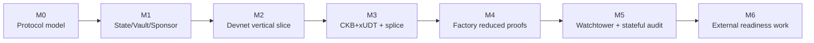
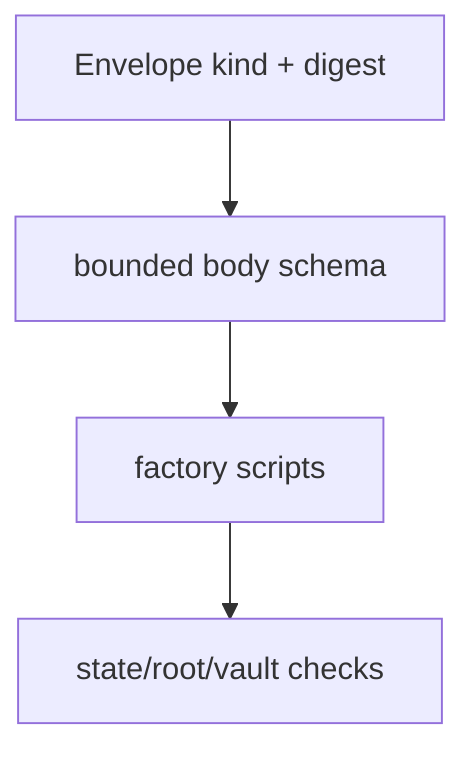
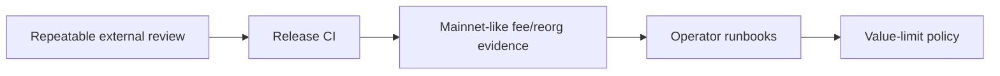

# Roadmap

This roadmap tracks Morph Channel's maturity from executable protocol model to
devnet evidence and, eventually, externally reviewed production readiness.

## Maturity Picture

The current repository sits at the devnet research implementation stage:
protocol objects, package tooling, CKB scripts, smoke tests, and stateful
acceptance gates exist locally. Production work remains open.

## Milestone Status

| Milestone | Status | What exists |
| --- | --- | --- |
| M0: Protocol semantics | Implemented | `morph-core` types, signing digests, validation invariants, and executable tests. |
| M1: Bilateral channel | Implemented | State Cell progression, Vault Cell settlement, sponsor fee boundary, and participant signatures. |
| M2: Devnet vertical slice | Implemented | Local CKB node flow, script deployment, channel open, state publication, vault finalisation, negative smokes, and reports. |
| M3: Assets and splice | Implemented locally | CKB+xUDT settlement, splice-in/out, funding epoch, vault-set commitment, package validation, and devnet smokes. |
| M4: Factory mode | Implemented narrowly | Conservative factory updates, local exits, reduced-rights proof, sparse-Merkle update, reduced exit, factory splice, and reduced splice through `WitnessEnvelope`. |
| M5: Watchtower and audit gates | Implemented locally | Watch config, policy checks, JSONL/webhook alerts, stale-package guard, smoke assertions, stateful assertions, and budget profiles. |
| M6: Production readiness | Controlled-devnet candidate; production open | Factory has a checked manifest/envelope and runbooks. Publication now has bounded node-informed fees, CKB RBF, least-privilege two-operator local evidence, and induced-reorg recovery. External review, independent rebuild/operators, and repeated public-network measurements remain open. |
| M7: Factory 2.0 surface (v2.0) | Implemented locally | Multi-right reduced updates (envelope kind 8), compact variable-depth sparse-Merkle proofs, and the operator value-limit policy with runbook; see `docs/v2.0-plan.md`. Devnet save/publication plumbing for kind 8 packages is the remaining follow-up. |

## Current Factory Witness Baseline

Factory authorisation uses `WitnessEnvelope`.

The remaining `*current` names in package or body schemas identify fixed-layout
schemas and historical evidence labels. They are not the current public factory
authorisation boundary.

## Deferred Work

| Area | Deferred item | Why it is deferred |
| --- | --- | --- |
| Factory proofs | ~~Multi-right reduced updates.~~ | Delivered in 2.0 as envelope kind 8; see `docs/v2.0-plan.md`. |
| Factory proofs | ~~Variable-depth or dynamic proof profiles.~~ | Delivered in 2.0 as compact bounded sparse-Merkle proofs on kind 8. |
| Factory 2.0 tooling | Devnet save/publication command for kind 8 state-cell packages. | Host validation, fixtures, and on-chain evidence exist; the live-node publication flow mirrors `save-factory-merkle-update-package` and needs a devnet rehearsal. |
| Factory membership | Larger participant sets with production ergonomics. | The wire supports 2-16 participants; production ergonomics still need proof-size, fee, and UX evidence. |
| Watchtower | Independent multi-operator deployment evidence. | Two isolated local operator scopes pass; distinct hosts, administrators, RPC providers, and alert paths still require rehearsal. |
| Network conditions | Repeated public-network reorg, delay, and fee-pressure runs. | A deterministic local fault-injection gate passes, but one devnet sample is not a production measurement. |
| Release process | Independent reproduction and release-owner sign-off. | Deterministic bundles, reviewed ELF hashes, successful main-branch CI upload/attestation, and staging cleanup exist; a successful independent external rebuild and release-owner sign-off remain open. |
| Policy | Value-limit policy and operator runbooks. | Delivered in 2.0 (`morph-core::policy`, `value-limit-check`, `docs/runbooks/value-limits.md`); enforcing it in live publication automation remains operator process work. |

## Next Engineering Slice

The next slice should not add protocol surface area merely because it is
interesting. The more valuable work is to harden evidence around the current
surface:

1. run devnet/stateful suites repeatedly from clean release artefacts;
2. record reviewable transaction and budget evidence;
3. test watchtower behaviour under delayed observation and stale packages;
4. document operational procedures for key handling, package retention, and
   alert response;
5. define conservative value limits tied to evidence, not optimism.

## How To Read Older Milestone Documents

Some closeout documents remain in this repository as historical evidence. They
are useful for understanding what was proved at a prior milestone, but current
design should be read from:

- [README.md](../README.md) for the human overview;
- [implementation.md](implementation.md) for protocol and script boundaries;
- [devnet.md](devnet.md) for executable local evidence;
- [mainnet-readiness.md](mainnet-readiness.md) for release gates.
