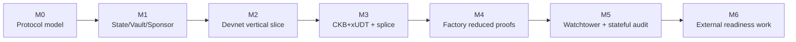
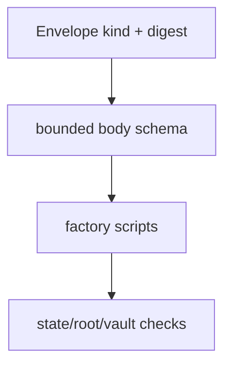
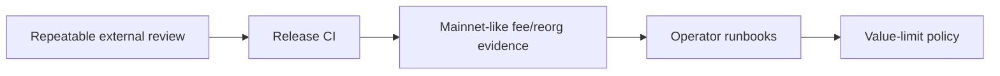

# Roadmap

This roadmap tracks Morph Channel's maturity from executable protocol model to
devnet evidence and, eventually, externally reviewed production readiness.

## Maturity Picture

The current repository sits at the devnet research implementation stage:
protocol objects, package tooling, CKB scripts, smoke tests, and stateful
acceptance gates exist locally. Production work remains open.

## Milestone Status

| Milestone | Status | What exists |
| --- | --- | --- |
| M0: Protocol semantics | Implemented | `morph-core` types, signing digests, validation invariants, and executable tests. |
| M1: Bilateral channel | Implemented | State Cell progression, Vault Cell settlement, sponsor fee boundary, and participant signatures. |
| M2: Devnet vertical slice | Implemented | Local CKB node flow, script deployment, channel open, state publication, vault finalisation, negative smokes, and reports. |
| M3: Assets and splice | Implemented locally | CKB+xUDT settlement, splice-in/out, funding epoch, vault-set commitment, package validation, and devnet smokes. |
| M4: Factory mode | Implemented narrowly | Conservative factory updates, local exits, reduced-rights proof, sparse-Merkle update, reduced exit, factory splice, and reduced splice through `WitnessEnvelope`. |
| M5: Watchtower and audit gates | Implemented locally | Watch config, policy checks, JSONL/webhook alerts, stale-package guard, smoke assertions, stateful assertions, and budget profiles. |
| M6: Production readiness | Controlled-devnet candidate; production open | Factory now has a checked manifest/envelope, runbooks, CI release provenance configuration, and canonical-cursor reorg recovery. External review, successful independent rebuild, mainnet-like fee/reorg runs, and multi-operator evidence remain open. |

## Current Factory Witness Baseline

Factory authorisation uses `WitnessEnvelope`.

The remaining `*current` names in package or body schemas identify fixed-layout
schemas and historical evidence labels. They are not the current public factory
authorisation boundary.

## Deferred Work

| Area | Deferred item | Why it is deferred |
| --- | --- | --- |
| Factory proofs | Multi-right reduced updates. | Current reduced paths intentionally prove one touched right. |
| Factory proofs | Variable-depth or dynamic proof profiles. | Current CKB body is bounded and fixed-layout for script simplicity. |
| Factory membership | Larger participant sets with production ergonomics. | Needs proof-size, fee, and UX evidence. |
| Watchtower | Multi-operator deployment evidence. | Current evidence is local and single-environment. |
| Network conditions | Reorg and fee-pressure runs. | Requires repeated mainnet-like devnet/testnet scenarios. |
| Release process | Independent reproduction and main-branch provenance completion. | Deterministic bundles, reviewed ELF hashes, CI upload/attestation configuration, and staging cleanup exist; a successful independent rebuild and release-owner sign-off remain open. |
| Policy | Value-limit policy and operator runbooks. | Needed before any real-assets claim. |

## Next Engineering Slice

The next slice should not add protocol surface area merely because it is
interesting. The more valuable work is to harden evidence around the current
surface:

1. run devnet/stateful suites repeatedly from clean release artefacts;
2. record reviewable transaction and budget evidence;
3. test watchtower behaviour under delayed observation and stale packages;
4. document operational procedures for key handling, package retention, and
   alert response;
5. define conservative value limits tied to evidence, not optimism.

## How To Read Older Milestone Documents

Some closeout documents remain in this repository as historical evidence. They
are useful for understanding what was proved at a prior milestone, but current
design should be read from:

- [README.md](../README.md) for the human overview;
- [implementation.md](implementation.md) for protocol and script boundaries;
- [devnet.md](devnet.md) for executable local evidence;
- [mainnet-readiness.md](mainnet-readiness.md) for release gates.
